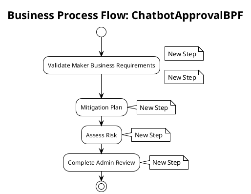

# Business Process Flow: ChatbotApprovalBPF

**Generated on:** 2025-07-15 19:14:49
**BPF ID:** 7175BCE5185D
**Source File:** ChatbotApprovalBPF-4D44FBE6-6ED0-463A-A73F-7175BCE5185D.xaml

## Overview

This document contains detailed documentation for the Business Process Flow.

### Summary
- **BPF Name:** ChatbotApprovalBPF
- **Stages:** 4
- **Total Steps:** 5
- **Total Controls:** 5

## Process Flow Diagram

## Stages and Steps

### Stage: Validate Maker Business Requirements
**Steps in this stage:**

| Step Name | Controls | Required Fields |
|-----------|----------|-----------------|
| New Step | Maker Submitted Requirements | No |
| New Step | Maker Requirement - Business Impact | No |

#### Step: New Step

**Controls:**

| Control Name | Control ID | Data Field | System Control |
|--------------|------------|------------|----------------|
| Maker Submitted Requirements | admin_makersubmittedrequirements | admin_makersubmittedrequirements | No |

#### Step: New Step

**Controls:**

| Control Name | Control ID | Data Field | System Control |
|--------------|------------|------------|----------------|
| Maker Requirement - Business Impact | admin_makerrequirementbusinessimpact | admin_makerrequirementbusinessimpact | No |

### Stage: Mitigation Plan
**Steps in this stage:**

| Step Name | Controls | Required Fields |
|-----------|----------|-----------------|
| New Step | Mitigation Plan Provided | No |

#### Step: New Step

**Controls:**

| Control Name | Control ID | Data Field | System Control |
|--------------|------------|------------|----------------|
| Mitigation Plan Provided | admin_mitigationplanprovided | admin_mitigationplanprovided | No |

### Stage: Assess Risk
**Steps in this stage:**

| Step Name | Controls | Required Fields |
|-----------|----------|-----------------|
| New Step | Admin Requirement - Risk Assessment | No |

#### Step: New Step

**Controls:**

| Control Name | Control ID | Data Field | System Control |
|--------------|------------|------------|----------------|
| Admin Requirement - Risk Assessment | admin_adminrequirementriskassessment | admin_adminrequirementriskassessment | No |

### Stage: Complete Admin Review
**Steps in this stage:**

| Step Name | Controls | Required Fields |
|-----------|----------|-----------------|
| New Step | Admin Requirement - Reviewed Bot | No |

#### Step: New Step

**Controls:**

| Control Name | Control ID | Data Field | System Control |
|--------------|------------|------------|----------------|
| Admin Requirement - Reviewed Bot | admin_adminrequirementreviewedbot | admin_adminrequirementreviewedbot | No |

## Process Statistics

| Metric | Value |
|--------|-------|
| **Total Stages** | 4 |
| **Total Steps** | 5 |
| **Total Controls** | 5 |
| **Average Steps per Stage** | 1.25 |
| **Average Controls per Step** | 1 |

---
*Documentation generated by Mightora Power Platform Workflows Documentation Generator*
