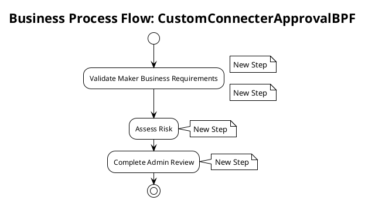

# Business Process Flow: CustomConnecterApprovalBPF

**Generated on:** 2025-07-15 19:14:49
**BPF ID:** E77119BCE352
**Source File:** CustomConnecterApprovalBPF-8B849D98-38FE-4896-8DD6-E77119BCE352.xaml

## Overview

This document contains detailed documentation for the Business Process Flow.

### Summary
- **BPF Name:** CustomConnecterApprovalBPF
- **Stages:** 3
- **Total Steps:** 4
- **Total Controls:** 4

## Process Flow Diagram

## Stages and Steps

### Stage: Validate Maker Business Requirements
**Steps in this stage:**

| Step Name | Controls | Required Fields |
|-----------|----------|-----------------|
| New Step | Maker Requirement - Business Justification | No |
| New Step | Maker Requirement - Conditions of Use | No |

#### Step: New Step

**Controls:**

| Control Name | Control ID | Data Field | System Control |
|--------------|------------|------------|----------------|
| Maker Requirement - Business Justification | admin_makerrequirementbusinessjustification | admin_makerrequirementbusinessjustification | No |

#### Step: New Step

**Controls:**

| Control Name | Control ID | Data Field | System Control |
|--------------|------------|------------|----------------|
| Maker Requirement - Conditions of Use | admin_makerrequirementconditionsofuse | admin_makerrequirementconditionsofuse | No |

### Stage: Assess Risk
**Steps in this stage:**

| Step Name | Controls | Required Fields |
|-----------|----------|-----------------|
| New Step | Admin Requirement - Risk Assessment | No |

#### Step: New Step

**Controls:**

| Control Name | Control ID | Data Field | System Control |
|--------------|------------|------------|----------------|
| Admin Requirement - Risk Assessment | admin_adminrequirementriskassessment | admin_adminrequirementriskassessment | No |

### Stage: Complete Admin Review
**Steps in this stage:**

| Step Name | Controls | Required Fields |
|-----------|----------|-----------------|
| New Step | Admin Requirement - Reviewed Connector | No |

#### Step: New Step

**Controls:**

| Control Name | Control ID | Data Field | System Control |
|--------------|------------|------------|----------------|
| Admin Requirement - Reviewed Connector | admin_adminrequirementreviewedconnector | admin_adminrequirementreviewedconnector | No |

## Process Statistics

| Metric | Value |
|--------|-------|
| **Total Stages** | 3 |
| **Total Steps** | 4 |
| **Total Controls** | 4 |
| **Average Steps per Stage** | 1.33 |
| **Average Controls per Step** | 1 |

---
*Documentation generated by Mightora Power Platform Workflows Documentation Generator*
