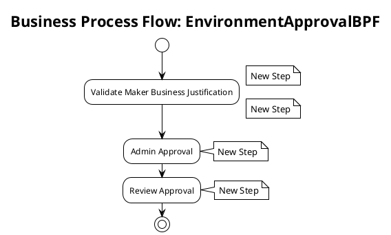

# Business Process Flow: EnvironmentApprovalBPF

**Generated on:** 2025-07-15 19:14:49
**BPF ID:** 3F92B10F5009
**Source File:** EnvironmentApprovalBPF-6CB36D96-1136-407B-B059-3F92B10F5009.xaml

## Overview

This document contains detailed documentation for the Business Process Flow.

### Summary
- **BPF Name:** EnvironmentApprovalBPF
- **Stages:** 3
- **Total Steps:** 4
- **Total Controls:** 4

## Process Flow Diagram

## Stages and Steps

### Stage: Validate Maker Business Justification
**Steps in this stage:**

| Step Name | Controls | Required Fields |
|-----------|----------|-----------------|
| New Step | Environment Sku | No |
| New Step | Maker Requirement - Business Justification | No |

#### Step: New Step

**Controls:**

| Control Name | Control ID | Data Field | System Control |
|--------------|------------|------------|----------------|
| Environment Sku | admin_environmentsku | admin_environmentsku | No |

#### Step: New Step

**Controls:**

| Control Name | Control ID | Data Field | System Control |
|--------------|------------|------------|----------------|
| Maker Requirement - Business Justification | admin_makerrequirementbusinessjustification | admin_makerrequirementbusinessjustification | No |

### Stage: Admin Approval
**Steps in this stage:**

| Step Name | Controls | Required Fields |
|-----------|----------|-----------------|
| New Step | Admin - Microsoft Teams Environment Status | No |

#### Step: New Step

**Controls:**

| Control Name | Control ID | Data Field | System Control |
|--------------|------------|------------|----------------|
| Admin - Microsoft Teams Environment Status | admin_adminmicrosoftteamsenvironmentstatus | admin_adminmicrosoftteamsenvironmentstatus | No |

### Stage: Review Approval
**Steps in this stage:**

| Step Name | Controls | Required Fields |
|-----------|----------|-----------------|
| New Step | Admin - Review Teams Environment Status On | No |

#### Step: New Step

**Controls:**

| Control Name | Control ID | Data Field | System Control |
|--------------|------------|------------|----------------|
| Admin - Review Teams Environment Status On | admin_adminreviewon | admin_adminreviewon | No |

## Process Statistics

| Metric | Value |
|--------|-------|
| **Total Stages** | 3 |
| **Total Steps** | 4 |
| **Total Controls** | 4 |
| **Average Steps per Stage** | 1.33 |
| **Average Controls per Step** | 1 |

---
*Documentation generated by Mightora Power Platform Workflows Documentation Generator*
