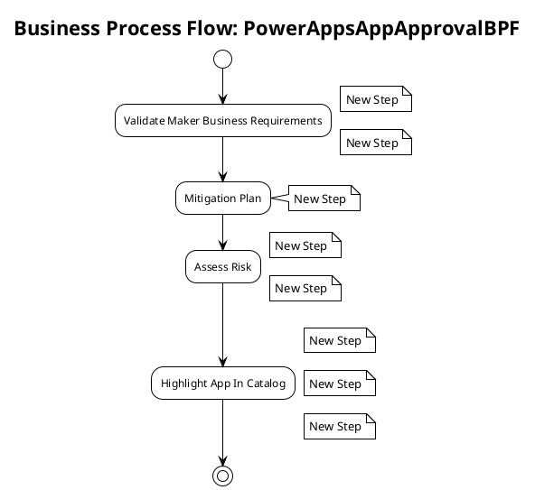

# Business Process Flow: PowerAppsAppApprovalBPF

**Generated on:** 2025-07-15 19:14:49
**BPF ID:** A558129651A2
**Source File:** PowerAppsAppApprovalBPF-FFA183A6-76D6-4EC9-AEE6-A558129651A2.xaml

## Overview

This document contains detailed documentation for the Business Process Flow.

### Summary
- **BPF Name:** PowerAppsAppApprovalBPF
- **Stages:** 4
- **Total Steps:** 8
- **Total Controls:** 8

## Process Flow Diagram

## Stages and Steps

### Stage: Validate Maker Business Requirements
**Steps in this stage:**

| Step Name | Controls | Required Fields |
|-----------|----------|-----------------|
| New Step | Maker Submitted Requirements | No |
| New Step | Maker Requirement - Business Impact | No |

#### Step: New Step

**Controls:**

| Control Name | Control ID | Data Field | System Control |
|--------------|------------|------------|----------------|
| Maker Submitted Requirements | admin_makersubmittedrequirements | admin_makersubmittedrequirements | No |

#### Step: New Step

**Controls:**

| Control Name | Control ID | Data Field | System Control |
|--------------|------------|------------|----------------|
| Maker Requirement - Business Impact | admin_requirement_4 | admin_requirement_4 | No |

### Stage: Mitigation Plan
**Steps in this stage:**

| Step Name | Controls | Required Fields |
|-----------|----------|-----------------|
| New Step | Mitigation Plan Provided | No |

#### Step: New Step

**Controls:**

| Control Name | Control ID | Data Field | System Control |
|--------------|------------|------------|----------------|
| Mitigation Plan Provided | admin_requirement_5 | admin_requirement_5 | No |

### Stage: Assess Risk
**Steps in this stage:**

| Step Name | Controls | Required Fields |
|-----------|----------|-----------------|
| New Step | Admin Requirement - Risk Assessment | No |
| New Step | Quarantine App | No |

#### Step: New Step

**Controls:**

| Control Name | Control ID | Data Field | System Control |
|--------------|------------|------------|----------------|
| Admin Requirement - Risk Assessment | admin_riskassessment | admin_riskassessment | No |

#### Step: New Step

**Controls:**

| Control Name | Control ID | Data Field | System Control |
|--------------|------------|------------|----------------|
| Quarantine App | admin_quarantineapp | admin_quarantineapp | No |

### Stage: Highlight App In Catalog
**Steps in this stage:**

| Step Name | Controls | Required Fields |
|-----------|----------|-----------------|
| New Step | Category | No |
| New Step | In App Catalog | No |
| New Step | In App Catalog Featured | No |

#### Step: New Step

**Controls:**

| Control Name | Control ID | Data Field | System Control |
|--------------|------------|------------|----------------|
| Category | admin_category | admin_category | No |

#### Step: New Step

**Controls:**

| Control Name | Control ID | Data Field | System Control |
|--------------|------------|------------|----------------|
| In App Catalog | admin_inappcatalog | admin_inappcatalog | No |

#### Step: New Step

**Controls:**

| Control Name | Control ID | Data Field | System Control |
|--------------|------------|------------|----------------|
| In App Catalog Featured | admin_inappcatalogfeatured | admin_inappcatalogfeatured | No |

## Process Statistics

| Metric | Value |
|--------|-------|
| **Total Stages** | 4 |
| **Total Steps** | 8 |
| **Total Controls** | 8 |
| **Average Steps per Stage** | 2 |
| **Average Controls per Step** | 1 |

---
*Documentation generated by Mightora Power Platform Workflows Documentation Generator*
