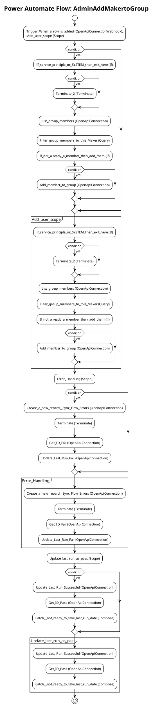

# Power Automate Flow: AdminAddMakertoGroup

**Generated on:** 2025-07-15 19:14:46
**Flow ID:** 6045BD045863
**Source File:** AdminAddMakertoGroup-E57EB48A-F9E5-EE11-904C-6045BD045863.json

## Overview

This document contains detailed documentation for the Power Automate flow.

### Summary
- **Flow Name:** AdminAddMakertoGroup
- **Triggers:** 1
- **Actions:** 1 1 1
- **Connections:** 3
- **Parameters:** 3

## Flow Diagram

## Connections

The following connections are used in this flow:

| Connection Key | API Name | Logical Name | Runtime Source |
|----------------|----------|--------------|----------------|
| shared_office365groups | shared_office365groups | admin_CoECoreO365Groups | embedded |
| shared_commondataserviceforapps | shared_commondataserviceforapps | admin_sharedcommondataserviceforapps_98924 | embedded |
| shared_commondataserviceforapps_1 | shared_commondataserviceforapps | admin_CoECoreDataverse2 | embedded |

## Parameters

| Parameter Name | Type | Default Value | Description |
|----------------|------|---------------|-------------|
| Power Platform Maker Group ID (admin_PowerPlatformMakeSecurityGroup) | String | f3374e9e-c5a1-452f-a305-9fa3de3b4050 | Inventory - Enter the ID of the Microsoft 365 group which will contain all your Power Platform Makers.  It is needed to communicate and share apps with them. |
| Power Automate Environment Variable (admin_PowerAutomateEnvironmentVariable) | String | https://flow.microsoft.com/manage/environments/ | Inventory - REQUIRED. Environment, including geographic location, for Power Automate - Ex for commercial: https://flow.microsoft.com/manage/environments/ |
| ProductionEnvironment (admin_ProductionEnvironment) | Bool | - | Inventory - Yes by default. Set to No if you are creating a dev type envt. This will allow some flows to set target users to the admin instead of resource owners |

## Triggers

### When_a_row_is_added
- **Type:** OpenApiConnectionWebhook
- **Recurrence:** N/A

## Actions Summary

| Action Name | Type | Description |
|-------------|------|-------------|
| Add_user_scope | Scope | Operation ID: 83fdd4c9-4584-4817-a5df-35a67fc6ba36 |
| Error_Handling | Scope | Operation ID: 38ae684e-622d-42ea-abd2-ee571aee3a5f |
| Update_last_run_as_pass | Scope | Operation ID: 5c140442-d939-4ca4-8ec8-d1ee2bed4a81 |

---
*Documentation generated by Mightora Power Platform Workflows Documentation Generator*
