# Power Automate Flow: AdminAuditLogsUpdateDataV2

**Generated on:** 2025-07-15 19:14:46
**Flow ID:** 000D3A3411D9
**Source File:** AdminAuditLogsUpdateDataV2-1D8BF7B1-D787-EE11-8179-000D3A3411D9.json

## Overview

This document contains detailed documentation for the Power Automate flow.

### Summary
- **Flow Name:** AdminAuditLogsUpdateDataV2
- **Triggers:** 1
- **Actions:** 1 1 1
- **Connections:** 3
- **Parameters:** 1

## Flow Diagram

```plantuml
@startuml
!theme plain
title Power Automate Flow: AdminAuditLogsUpdateDataV2

start
:Trigger: When_a_row_is_added_or_modified (OpenApiConnectionWebhook);\n:Error_Handling (Scope);
 if (condition) then (yes)
  :Create_a_new_record__Sync_Flow_Errors (OpenApiConnection);
  :Terminate (Terminate);
  :Get_ID_Fail (OpenApiConnection);
  :Update_Last_Run_Fail (OpenApiConnection);
 endif
 partition "Error_Handling" {
  :Create_a_new_record__Sync_Flow_Errors (OpenApiConnection);
  :Terminate (Terminate);
  :Get_ID_Fail (OpenApiConnection);
  :Update_Last_Run_Fail (OpenApiConnection);
 }
:Update_last_run_as_pass (Scope);
 if (condition) then (yes)
  :Update_Last_Run_Successful (OpenApiConnection);
  :Get_ID_Pass (OpenApiConnection);
  :Catch__not_ready_to_take_last_run_date (Compose);
 endif
 partition "Update_last_run_as_pass" {
  :Update_Last_Run_Successful (OpenApiConnection);
  :Get_ID_Pass (OpenApiConnection);
  :Catch__not_ready_to_take_last_run_date (Compose);
 }
:Update_Data (Scope);
 if (condition) then (yes)
  :Derive_and_Update_App_Data (Scope);
   if (condition) then (yes)
    :AppID (Compose);
    :GetApp (OpenApiConnection);
    :AppDoesNotExist (Compose);
    :Updaet_App_Data (Scope);
     if (condition) then (yes)
      :Update_AppLastLaunched (Scope);
       if (condition) then (yes)
        :Update_Last_Launched_if_newer (If);
         if (condition) then (yes)
          :Update_App_Last_Launch_Date (OpenApiConnection);
         endif
       endif
       partition "Update_AppLastLaunched" {
        :Update_Last_Launched_if_newer (If);
         if (condition) then (yes)
          :Update_App_Last_Launch_Date (OpenApiConnection);
         endif
       }
      :Update_Audit_Log_record_with_App_information (Scope);
       if (condition) then (yes)
        :Update_audit_log_record_app_info (OpenApiConnection);
       endif
       partition "Update_Audit_Log_record_with_App_information" {
        :Update_audit_log_record_app_info (OpenApiConnection);
       }
     endif
     partition "Updaet_App_Data" {
      :Update_AppLastLaunched (Scope);
       if (condition) then (yes)
        :Update_Last_Launched_if_newer (If);
         if (condition) then (yes)
          :Update_App_Last_Launch_Date (OpenApiConnection);
         endif
       endif
       partition "Update_AppLastLaunched" {
        :Update_Last_Launched_if_newer (If);
         if (condition) then (yes)
          :Update_App_Last_Launch_Date (OpenApiConnection);
         endif
       }
      :Update_Audit_Log_record_with_App_information (Scope);
       if (condition) then (yes)
        :Update_audit_log_record_app_info (OpenApiConnection);
       endif
       partition "Update_Audit_Log_record_with_App_information" {
        :Update_audit_log_record_app_info (OpenApiConnection);
       }
     }
   endif
   partition "Derive_and_Update_App_Data" {
    :AppID (Compose);
    :GetApp (OpenApiConnection);
    :AppDoesNotExist (Compose);
    :Updaet_App_Data (Scope);
     if (condition) then (yes)
      :Update_AppLastLaunched (Scope);
       if (condition) then (yes)
        :Update_Last_Launched_if_newer (If);
         if (condition) then (yes)
          :Update_App_Last_Launch_Date (OpenApiConnection);
         endif
       endif
       partition "Update_AppLastLaunched" {
        :Update_Last_Launched_if_newer (If);
         if (condition) then (yes)
          :Update_App_Last_Launch_Date (OpenApiConnection);
         endif
       }
      :Update_Audit_Log_record_with_App_information (Scope);
       if (condition) then (yes)
        :Update_audit_log_record_app_info (OpenApiConnection);
       endif
       partition "Update_Audit_Log_record_with_App_information" {
        :Update_audit_log_record_app_info (OpenApiConnection);
       }
     endif
     partition "Updaet_App_Data" {
      :Update_AppLastLaunched (Scope);
       if (condition) then (yes)
        :Update_Last_Launched_if_newer (If);
         if (condition) then (yes)
          :Update_App_Last_Launch_Date (OpenApiConnection);
         endif
       endif
       partition "Update_AppLastLaunched" {
        :Update_Last_Launched_if_newer (If);
         if (condition) then (yes)
          :Update_App_Last_Launch_Date (OpenApiConnection);
         endif
       }
      :Update_Audit_Log_record_with_App_information (Scope);
       if (condition) then (yes)
        :Update_audit_log_record_app_info (OpenApiConnection);
       endif
       partition "Update_Audit_Log_record_with_App_information" {
        :Update_audit_log_record_app_info (OpenApiConnection);
       }
     }
   }
  :Derive_and_Update_User_Data (Scope);
   if (condition) then (yes)
    :Search_for_users_V2 (OpenApiConnection);
    :split_UPN_on_hashtag (Compose);
    :UPN (Compose);
    :if_found_update_with_user_info (If);
     if (condition) then (yes)
      :Get_user_profile_V2 (OpenApiConnection);
      :Update_audit_log_record (OpenApiConnection);
     endif
   endif
   partition "Derive_and_Update_User_Data" {
    :Search_for_users_V2 (OpenApiConnection);
    :split_UPN_on_hashtag (Compose);
    :UPN (Compose);
    :if_found_update_with_user_info (If);
     if (condition) then (yes)
      :Get_user_profile_V2 (OpenApiConnection);
      :Update_audit_log_record (OpenApiConnection);
     endif
   }
 endif
 partition "Update_Data" {
  :Derive_and_Update_App_Data (Scope);
   if (condition) then (yes)
    :AppID (Compose);
    :GetApp (OpenApiConnection);
    :AppDoesNotExist (Compose);
    :Updaet_App_Data (Scope);
     if (condition) then (yes)
      :Update_AppLastLaunched (Scope);
       if (condition) then (yes)
        :Update_Last_Launched_if_newer (If);
         if (condition) then (yes)
          :Update_App_Last_Launch_Date (OpenApiConnection);
         endif
       endif
       partition "Update_AppLastLaunched" {
        :Update_Last_Launched_if_newer (If);
         if (condition) then (yes)
          :Update_App_Last_Launch_Date (OpenApiConnection);
         endif
       }
      :Update_Audit_Log_record_with_App_information (Scope);
       if (condition) then (yes)
        :Update_audit_log_record_app_info (OpenApiConnection);
       endif
       partition "Update_Audit_Log_record_with_App_information" {
        :Update_audit_log_record_app_info (OpenApiConnection);
       }
     endif
     partition "Updaet_App_Data" {
      :Update_AppLastLaunched (Scope);
       if (condition) then (yes)
        :Update_Last_Launched_if_newer (If);
         if (condition) then (yes)
          :Update_App_Last_Launch_Date (OpenApiConnection);
         endif
       endif
       partition "Update_AppLastLaunched" {
        :Update_Last_Launched_if_newer (If);
         if (condition) then (yes)
          :Update_App_Last_Launch_Date (OpenApiConnection);
         endif
       }
      :Update_Audit_Log_record_with_App_information (Scope);
       if (condition) then (yes)
        :Update_audit_log_record_app_info (OpenApiConnection);
       endif
       partition "Update_Audit_Log_record_with_App_information" {
        :Update_audit_log_record_app_info (OpenApiConnection);
       }
     }
   endif
   partition "Derive_and_Update_App_Data" {
    :AppID (Compose);
    :GetApp (OpenApiConnection);
    :AppDoesNotExist (Compose);
    :Updaet_App_Data (Scope);
     if (condition) then (yes)
      :Update_AppLastLaunched (Scope);
       if (condition) then (yes)
        :Update_Last_Launched_if_newer (If);
         if (condition) then (yes)
          :Update_App_Last_Launch_Date (OpenApiConnection);
         endif
       endif
       partition "Update_AppLastLaunched" {
        :Update_Last_Launched_if_newer (If);
         if (condition) then (yes)
          :Update_App_Last_Launch_Date (OpenApiConnection);
         endif
       }
      :Update_Audit_Log_record_with_App_information (Scope);
       if (condition) then (yes)
        :Update_audit_log_record_app_info (OpenApiConnection);
       endif
       partition "Update_Audit_Log_record_with_App_information" {
        :Update_audit_log_record_app_info (OpenApiConnection);
       }
     endif
     partition "Updaet_App_Data" {
      :Update_AppLastLaunched (Scope);
       if (condition) then (yes)
        :Update_Last_Launched_if_newer (If);
         if (condition) then (yes)
          :Update_App_Last_Launch_Date (OpenApiConnection);
         endif
       endif
       partition "Update_AppLastLaunched" {
        :Update_Last_Launched_if_newer (If);
         if (condition) then (yes)
          :Update_App_Last_Launch_Date (OpenApiConnection);
         endif
       }
      :Update_Audit_Log_record_with_App_information (Scope);
       if (condition) then (yes)
        :Update_audit_log_record_app_info (OpenApiConnection);
       endif
       partition "Update_Audit_Log_record_with_App_information" {
        :Update_audit_log_record_app_info (OpenApiConnection);
       }
     }
   }
  :Derive_and_Update_User_Data (Scope);
   if (condition) then (yes)
    :Search_for_users_V2 (OpenApiConnection);
    :split_UPN_on_hashtag (Compose);
    :UPN (Compose);
    :if_found_update_with_user_info (If);
     if (condition) then (yes)
      :Get_user_profile_V2 (OpenApiConnection);
      :Update_audit_log_record (OpenApiConnection);
     endif
   endif
   partition "Derive_and_Update_User_Data" {
    :Search_for_users_V2 (OpenApiConnection);
    :split_UPN_on_hashtag (Compose);
    :UPN (Compose);
    :if_found_update_with_user_info (If);
     if (condition) then (yes)
      :Get_user_profile_V2 (OpenApiConnection);
      :Update_audit_log_record (OpenApiConnection);
     endif
   }
 }

stop
@enduml
```

## Connections

The following connections are used in this flow:

| Connection Key | API Name | Logical Name | Runtime Source |
|----------------|----------|--------------|----------------|
| shared_commondataserviceforapps | shared_commondataserviceforapps | admin_CoECoreDataverse | embedded |
| shared_commondataserviceforapps_1 | shared_commondataserviceforapps | admin_CoECoreDataverseForApps | embedded |
| shared_office365users | shared_office365users | admin_CoECoreO365Users | embedded |

## Parameters

| Parameter Name | Type | Default Value | Description |
|----------------|------|---------------|-------------|
| Power Automate Environment Variable (admin_PowerAutomateEnvironmentVariable) | String | https://flow.microsoft.com/manage/environments/ | Inventory - REQUIRED. Environment, including geographic location, for Power Automate - Ex for commercial: https://flow.microsoft.com/manage/environments/ |

## Triggers

### When_a_row_is_added_or_modified
- **Type:** OpenApiConnectionWebhook
- **Recurrence:** N/A

## Actions Summary

| Action Name | Type | Description |
|-------------|------|-------------|
| Error_Handling | Scope | Operation ID: 38ae684e-622d-42ea-abd2-ee571aee3a5f |
| Update_last_run_as_pass | Scope | Operation ID: 5c140442-d939-4ca4-8ec8-d1ee2bed4a81 |
| Update_Data | Scope | Operation ID: 46eabbaa-5526-40c2-b050-a4712e81b0b1 |

---
*Documentation generated by Mightora Power Platform Workflows Documentation Generator*
