# Power Automate Flow: AdminCapacityAlerts

**Generated on:** 2025-07-15 19:14:46
**Flow ID:** 000D3A1F6308
**Source File:** AdminCapacityAlerts-108A99EF-B08C-EB11-A812-000D3A1F6308.json

## Overview

This document contains detailed documentation for the Power Automate flow.

### Summary
- **Flow Name:** AdminCapacityAlerts
- **Triggers:** 1
- **Actions:** 1 1 1 1 1 1 1 1 1 1
- **Connections:** 2
- **Parameters:** 4

## Flow Diagram

```plantuml
@startuml
!theme plain
title Power Automate Flow: AdminCapacityAlerts

start
:Trigger: Recurrence (Recurrence);\n:Initialize_adminMail (InitializeVariable);
:Initialize_htmlHeader (InitializeVariable);
:Initialize_varCloseToCapacity (InitializeVariable);
:Initialize_varOverCapacity (InitializeVariable);
:Initialize_emailGUID (InitializeVariable);
:Run_Capacity_Alerts_Scope (Scope);
 if (condition) then (yes)
  :List_Environment_Capacity_information (OpenApiConnection);
  :Apply_to_each_capacity (Foreach);
   if (condition) then (yes)
    :Actual_is_x_percent_of_Approved_Default_8 (If);
     if (condition) then (yes)
      :Append_to_array_variable_2 (AppendToArrayVariable);
     endif
    :Actual_is_over_Approved (If);
     if (condition) then (yes)
      :Append_to_array_variable (AppendToArrayVariable);
     endif
    :Compose (Compose);
   endif
   repeat
    :Actual_is_x_percent_of_Approved_Default_8 (If);
     if (condition) then (yes)
      :Append_to_array_variable_2 (AppendToArrayVariable);
     endif
    :Actual_is_over_Approved (If);
     if (condition) then (yes)
      :Append_to_array_variable (AppendToArrayVariable);
     endif
    :Compose (Compose);
   repeat while (more items)
  :Create_Over_Capacity (Table);
  :Create_Close_to_Capacity (Table);
  :Send_mail_if_any_over_capacity (If);
   if (condition) then (yes)
    :Get_Row__Send_Over_Capacity_Envts_to_Admin (Scope);
     if (condition) then (yes)
      :emailGUID_to_enUS (Compose);
      :List_emails_for_preferred_language (OpenApiConnection);
      :Set_emailGUID_to_localized_row (SetVariable);
      :Get_a_row_by_ID (OpenApiConnection);
     endif
     partition "Get_Row__Send_Over_Capacity_Envts_to_Admin" {
      :emailGUID_to_enUS (Compose);
      :List_emails_for_preferred_language (OpenApiConnection);
      :Set_emailGUID_to_localized_row (SetVariable);
      :Get_a_row_by_ID (OpenApiConnection);
     }
    :Send_Over_Capacity_Envts_to_Admin (Workflow);
   endif
  :List_Chatbots_with_capacity (OpenApiConnection);
  :Apply_to_each_chatbot (Foreach);
   if (condition) then (yes)
    :Actual_sessions_is_over_approved (If);
     if (condition) then (yes)
      :Append_to_array_variable_3 (AppendToArrayVariable);
     endif
    :Chatbot_is_x_percent_of_Approved_Default_8 (If);
     if (condition) then (yes)
      :Append_to_array_variable_4 (AppendToArrayVariable);
     endif
   endif
   repeat
    :Actual_sessions_is_over_approved (If);
     if (condition) then (yes)
      :Append_to_array_variable_3 (AppendToArrayVariable);
     endif
    :Chatbot_is_x_percent_of_Approved_Default_8 (If);
     if (condition) then (yes)
      :Append_to_array_variable_4 (AppendToArrayVariable);
     endif
   repeat while (more items)
  :Create_Chatbot_Over (Table);
  :Create_Chatbot_close (Table);
  :Send_mail_if_any_near_capacity (If);
   if (condition) then (yes)
    :Send_Near_Capacity_Envts_to_Admin (Workflow);
    :Get_Row__Send_Near_Capacity_Envts_to_Admin (Scope);
     if (condition) then (yes)
      :emailGUID_to_enUS_2 (Compose);
      :List_emails_for_preferred_language_2 (OpenApiConnection);
      :Set_emailGUID_to_localized_row_2 (SetVariable);
      :Get_a_row_by_ID_2 (OpenApiConnection);
     endif
     partition "Get_Row__Send_Near_Capacity_Envts_to_Admin" {
      :emailGUID_to_enUS_2 (Compose);
      :List_emails_for_preferred_language_2 (OpenApiConnection);
      :Set_emailGUID_to_localized_row_2 (SetVariable);
      :Get_a_row_by_ID_2 (OpenApiConnection);
     }
   endif
 endif
 partition "Run_Capacity_Alerts_Scope" {
  :List_Environment_Capacity_information (OpenApiConnection);
  :Apply_to_each_capacity (Foreach);
   if (condition) then (yes)
    :Actual_is_x_percent_of_Approved_Default_8 (If);
     if (condition) then (yes)
      :Append_to_array_variable_2 (AppendToArrayVariable);
     endif
    :Actual_is_over_Approved (If);
     if (condition) then (yes)
      :Append_to_array_variable (AppendToArrayVariable);
     endif
    :Compose (Compose);
   endif
   repeat
    :Actual_is_x_percent_of_Approved_Default_8 (If);
     if (condition) then (yes)
      :Append_to_array_variable_2 (AppendToArrayVariable);
     endif
    :Actual_is_over_Approved (If);
     if (condition) then (yes)
      :Append_to_array_variable (AppendToArrayVariable);
     endif
    :Compose (Compose);
   repeat while (more items)
  :Create_Over_Capacity (Table);
  :Create_Close_to_Capacity (Table);
  :Send_mail_if_any_over_capacity (If);
   if (condition) then (yes)
    :Get_Row__Send_Over_Capacity_Envts_to_Admin (Scope);
     if (condition) then (yes)
      :emailGUID_to_enUS (Compose);
      :List_emails_for_preferred_language (OpenApiConnection);
      :Set_emailGUID_to_localized_row (SetVariable);
      :Get_a_row_by_ID (OpenApiConnection);
     endif
     partition "Get_Row__Send_Over_Capacity_Envts_to_Admin" {
      :emailGUID_to_enUS (Compose);
      :List_emails_for_preferred_language (OpenApiConnection);
      :Set_emailGUID_to_localized_row (SetVariable);
      :Get_a_row_by_ID (OpenApiConnection);
     }
    :Send_Over_Capacity_Envts_to_Admin (Workflow);
   endif
  :List_Chatbots_with_capacity (OpenApiConnection);
  :Apply_to_each_chatbot (Foreach);
   if (condition) then (yes)
    :Actual_sessions_is_over_approved (If);
     if (condition) then (yes)
      :Append_to_array_variable_3 (AppendToArrayVariable);
     endif
    :Chatbot_is_x_percent_of_Approved_Default_8 (If);
     if (condition) then (yes)
      :Append_to_array_variable_4 (AppendToArrayVariable);
     endif
   endif
   repeat
    :Actual_sessions_is_over_approved (If);
     if (condition) then (yes)
      :Append_to_array_variable_3 (AppendToArrayVariable);
     endif
    :Chatbot_is_x_percent_of_Approved_Default_8 (If);
     if (condition) then (yes)
      :Append_to_array_variable_4 (AppendToArrayVariable);
     endif
   repeat while (more items)
  :Create_Chatbot_Over (Table);
  :Create_Chatbot_close (Table);
  :Send_mail_if_any_near_capacity (If);
   if (condition) then (yes)
    :Send_Near_Capacity_Envts_to_Admin (Workflow);
    :Get_Row__Send_Near_Capacity_Envts_to_Admin (Scope);
     if (condition) then (yes)
      :emailGUID_to_enUS_2 (Compose);
      :List_emails_for_preferred_language_2 (OpenApiConnection);
      :Set_emailGUID_to_localized_row_2 (SetVariable);
      :Get_a_row_by_ID_2 (OpenApiConnection);
     endif
     partition "Get_Row__Send_Near_Capacity_Envts_to_Admin" {
      :emailGUID_to_enUS_2 (Compose);
      :List_emails_for_preferred_language_2 (OpenApiConnection);
      :Set_emailGUID_to_localized_row_2 (SetVariable);
      :Get_a_row_by_ID_2 (OpenApiConnection);
     }
   endif
 }
:Error_Handling (Scope);
 if (condition) then (yes)
  :Create_a_new_record__Sync_Flow_Errors (OpenApiConnection);
  :Terminate (Terminate);
  :Get_ID_Fail (OpenApiConnection);
  :Update_Last_Run_Fail (OpenApiConnection);
 endif
 partition "Error_Handling" {
  :Create_a_new_record__Sync_Flow_Errors (OpenApiConnection);
  :Terminate (Terminate);
  :Get_ID_Fail (OpenApiConnection);
  :Update_Last_Run_Fail (OpenApiConnection);
 }
:Update_last_run_as_pass (Scope);
 if (condition) then (yes)
  :Update_Last_Run_Successful (OpenApiConnection);
  :Get_ID_Pass (OpenApiConnection);
  :Catch__not_ready_to_take_last_run_date (Compose);
 endif
 partition "Update_last_run_as_pass" {
  :Update_Last_Run_Successful (OpenApiConnection);
  :Get_ID_Pass (OpenApiConnection);
  :Catch__not_ready_to_take_last_run_date (Compose);
 }
:Initialize_varChatbotOver (InitializeVariable);
:Initialize_varChatbotClose (InitializeVariable);

stop
@enduml
```

## Connections

The following connections are used in this flow:

| Connection Key | API Name | Logical Name | Runtime Source |
|----------------|----------|--------------|----------------|
| shared_commondataserviceforapps | shared_commondataserviceforapps | admin_CoECoreDataverse2 | embedded |
| shared_commondataserviceforapps_1 | shared_commondataserviceforapps | admin_CoECoreDataverseEnvRequest | embedded |

## Parameters

| Parameter Name | Type | Default Value | Description |
|----------------|------|---------------|-------------|
| Admin eMail Preferred Language (admin_AdmineMailPreferredLanguage) | String | en-US | Inventory - The preferred language for the emails sent to the admin email alias, which is specified in theAdmin eMail environment variable. Default is en-US |
| Admin eMail (admin_AdminMail) | String | PowerPlatformAdmins@powercattools.onmicrosoft.com | Inventory - CoE Admin eMail. Email address used in flows to send notifications to admins; this should be either your email address or a distribution list |
| Power Automate Environment Variable (admin_PowerAutomateEnvironmentVariable) | String | https://flow.microsoft.com/manage/environments/ | Inventory - REQUIRED. Environment, including geographic location, for Power Automate - Ex for commercial: https://flow.microsoft.com/manage/environments/ |
| Capacity alert percentage  (admin_Capacityalertpercentage) | Float | 0.8 | Percentage amount of capacity used at which to alert. Deault is 0.8 (80%) |

## Triggers

### Recurrence
- **Type:** Recurrence
- **Recurrence:** Frequency: Week, Interval: 1

## Actions Summary

| Action Name | Type | Description |
|-------------|------|-------------|
| Initialize_adminMail | InitializeVariable | Operation ID: 1a299f25-f946-46e9-9550-c8431a29e0fe |
| Initialize_htmlHeader | InitializeVariable | Operation ID: c1598f26-ca58-4681-809d-c554cb7f0ee2 |
| Initialize_varCloseToCapacity | InitializeVariable | Operation ID: 63d14baa-b5c7-4a99-a0bd-88610c9d14d2 |
| Initialize_varOverCapacity | InitializeVariable | Operation ID: f55703aa-8bc1-42a5-888d-e8393db07d28 |
| Initialize_emailGUID | InitializeVariable | Operation ID: dad8eca6-7937-47c0-aa57-f2d48dd1c5a2 |
| Run_Capacity_Alerts_Scope | Scope | Operation ID: 5daf4ce6-ea48-4b9a-bf45-b21289fdb80f |
| Error_Handling | Scope | Operation ID: 38ae684e-622d-42ea-abd2-ee571aee3a5f |
| Update_last_run_as_pass | Scope | Operation ID: 5c140442-d939-4ca4-8ec8-d1ee2bed4a81 |
| Initialize_varChatbotOver | InitializeVariable | Operation ID: 1b64a01e-3002-4bc9-a2c5-cd5a3bcb969c |
| Initialize_varChatbotClose | InitializeVariable | Operation ID: 087fca45-85c8-4045-b99d-80f289c8fe53 |

---
*Documentation generated by Mightora Power Platform Workflows Documentation Generator*
