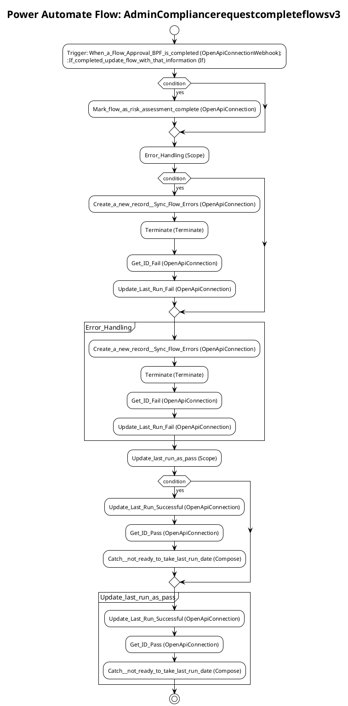

# Power Automate Flow: AdminCompliancerequestcompleteflowsv3

**Generated on:** 2025-07-15 19:14:46
**Flow ID:** 000D3A5574A2
**Source File:** AdminCompliancerequestcompleteflowsv3-3D9B7C18-0936-EC11-B6E6-000D3A5574A2.json

## Overview

This document contains detailed documentation for the Power Automate flow.

### Summary
- **Flow Name:** AdminCompliancerequestcompleteflowsv3
- **Triggers:** 1
- **Actions:** 1 1 1
- **Connections:** 
- **Parameters:** 1

## Flow Diagram

## Connections

The following connections are used in this flow:

| Connection Key | API Name | Logical Name | Runtime Source |
|----------------|----------|--------------|----------------|
| shared_commondataserviceforapps | shared_commondataserviceforapps | admin_CoECoreDataverse2 | embedded |

## Parameters

| Parameter Name | Type | Default Value | Description |
|----------------|------|---------------|-------------|
| Power Automate Environment Variable (admin_PowerAutomateEnvironmentVariable) | String | https://flow.microsoft.com/manage/environments/ | Inventory - REQUIRED. Environment, including geographic location, for Power Automate - Ex for commercial: https://flow.microsoft.com/manage/environments/ |

## Triggers

### When_a_Flow_Approval_BPF_is_completed
- **Type:** OpenApiConnectionWebhook
- **Recurrence:** N/A

## Actions Summary

| Action Name | Type | Description |
|-------------|------|-------------|
| If_completed,_update_flow_with_that_information | If | Operation ID: f614ab1c-7282-47c0-9359-2a0ea38bc1ec |
| Error_Handling | Scope | Operation ID: 38ae684e-622d-42ea-abd2-ee571aee3a5f |
| Update_last_run_as_pass | Scope | Operation ID: 5c140442-d939-4ca4-8ec8-d1ee2bed4a81 |

---
*Documentation generated by Mightora Power Platform Workflows Documentation Generator*
