# Power Automate Flow: AdminSyncTemplatev3SyncFlowErrors

**Generated on:** 2025-07-15 19:14:47
**Flow ID:** 000D3A8F4AD6
**Source File:** AdminSyncTemplatev3SyncFlowErrors-69C0077E-DF40-EB11-A813-000D3A8F4AD6.json

## Overview

This document contains detailed documentation for the Power Automate flow.

### Summary
- **Flow Name:** AdminSyncTemplatev3SyncFlowErrors
- **Triggers:** 1
- **Actions:** 1 1 1 1 1 1 1 1 1
- **Connections:** 2
- **Parameters:** 4

## Flow Diagram

```plantuml
@startuml
!theme plain
title Power Automate Flow: AdminSyncTemplatev3SyncFlowErrors

start
:Trigger: Recurrence (Recurrence);\n:Check_if_there_were_Sync_Flow_errors (If);
 if (condition) then (yes)
  :Compose_HTML_Table (Compose);
  :Filter_array (Query);
  :Create_HTML_table (Table);
  :Delete_week_old_Sync_Flow_errors (Foreach);
   if (condition) then (yes)
    :Delete_a_record (OpenApiConnection);
   endif
   repeat
    :Delete_a_record (OpenApiConnection);
   repeat while (more items)
  :Filter_old (Query);
  :If_table_is_not_empty_send_mail (If);
   if (condition) then (yes)
    :Send_Sync_Flows_to_Admin (Workflow);
    :Get_Row__Send_Sync_Flows_to_Admin (Scope);
     if (condition) then (yes)
      :emailGUID_to_enUS (Compose);
      :List_emails_for_preferred_language (OpenApiConnection);
      :Set_emailGUID_to_localized_row (SetVariable);
      :Get_a_row_by_ID (OpenApiConnection);
     endif
     partition "Get_Row__Send_Sync_Flows_to_Admin" {
      :emailGUID_to_enUS (Compose);
      :List_emails_for_preferred_language (OpenApiConnection);
      :Set_emailGUID_to_localized_row (SetVariable);
      :Get_a_row_by_ID (OpenApiConnection);
     }
    :Get_Environment_as_Admin (OpenApiConnection);
   endif
 endif
:Initialize_Admin_eMail_variable (InitializeVariable);
:Initialize_Style_for_HTML_eMail (InitializeVariable);
:List_Sync_Flow_Errors (OpenApiConnection);
:Get_yesterday (Expression);
:Get_x_days_past (Expression);
:Initialize_emailGUID (InitializeVariable);
:Error_Handling (Scope);
 if (condition) then (yes)
  :Create_a_new_record__Sync_Flow_Errors (OpenApiConnection);
  :Terminate (Terminate);
  :Get_ID_Fail (OpenApiConnection);
  :Update_Last_Run_Fail (OpenApiConnection);
 endif
 partition "Error_Handling" {
  :Create_a_new_record__Sync_Flow_Errors (OpenApiConnection);
  :Terminate (Terminate);
  :Get_ID_Fail (OpenApiConnection);
  :Update_Last_Run_Fail (OpenApiConnection);
 }
:Update_last_run_as_pass (Scope);
 if (condition) then (yes)
  :Update_Last_Run_Successful (OpenApiConnection);
  :Get_ID_Pass (OpenApiConnection);
  :Catch__not_ready_to_take_last_run_date (Compose);
 endif
 partition "Update_last_run_as_pass" {
  :Update_Last_Run_Successful (OpenApiConnection);
  :Get_ID_Pass (OpenApiConnection);
  :Catch__not_ready_to_take_last_run_date (Compose);
 }

stop
@enduml
```

## Connections

The following connections are used in this flow:

| Connection Key | API Name | Logical Name | Runtime Source |
|----------------|----------|--------------|----------------|
| shared_commondataserviceforapps | shared_commondataserviceforapps | admin_CoECoreDataverse | embedded |
| shared_powerplatformforadmins | shared_powerplatformforadmins | admin_CoECorePowerPlatformforAdminsEnvRequest | embedded |

## Parameters

| Parameter Name | Type | Default Value | Description |
|----------------|------|---------------|-------------|
| Admin eMail Preferred Language (admin_AdmineMailPreferredLanguage) | String | en-US | Inventory - The preferred language for the emails sent to the admin email alias, which is specified in theAdmin eMail environment variable. Default is en-US |
| Admin eMail (admin_AdminMail) | String | PowerPlatformAdmins@powercattools.onmicrosoft.com | Inventory - CoE Admin eMail. Email address used in flows to send notifications to admins; this should be either your email address or a distribution list |
| Power Automate Environment Variable (admin_PowerAutomateEnvironmentVariable) | String | https://flow.microsoft.com/manage/environments/ | Inventory - REQUIRED. Environment, including geographic location, for Power Automate - Ex for commercial: https://flow.microsoft.com/manage/environments/ |
| Sync Flow Errors Delete After X Days (admin_SyncFlowErrorsDeleteAfterXDays) | Int | 7 | Inventory - Number of days back to store sync flow error records. Will delete records older than this number of days. Default 7 |

## Triggers

### Recurrence
- **Type:** Recurrence
- **Recurrence:** Frequency: Day, Interval: 1

## Actions Summary

| Action Name | Type | Description |
|-------------|------|-------------|
| Check_if_there_were_Sync_Flow_errors | If | Operation ID: ef4b54a0-859b-4e8d-bfcc-8fdd87555820 |
| Initialize_Admin_eMail_variable | InitializeVariable | Operation ID: 0c74415a-8e2b-4e32-aa16-39819d484a0b |
| Initialize_Style_for_HTML_eMail | InitializeVariable | Operation ID: 03445452-ca60-4a59-8389-f1a4edc6aff9 |
| List_Sync_Flow_Errors | OpenApiConnection | Operation ID: 72c605dd-6337-4137-bc5a-14408e2e9bf4 |
| Get_yesterday | Expression | Operation ID: 4494142e-5296-4c9a-8d2e-290a77d91844 |
| Get_x_days_past | Expression | Operation ID: 7f1514d7-141c-47ba-8769-f5375c7a95a7 |
| Initialize_emailGUID | InitializeVariable | Operation ID: dad8eca6-7937-47c0-aa57-f2d48dd1c5a2 |
| Error_Handling | Scope | Operation ID: 38ae684e-622d-42ea-abd2-ee571aee3a5f |
| Update_last_run_as_pass | Scope | Operation ID: 5c140442-d939-4ca4-8ec8-d1ee2bed4a81 |

---
*Documentation generated by Mightora Power Platform Workflows Documentation Generator*
