# Power Automate Flow: AdminSyncTemplatev4AIUsage

**Generated on:** 2025-07-15 19:14:47
**Flow ID:** 000D3A341FFF
**Source File:** AdminSyncTemplatev4AIUsage-9BBE33D2-BCE6-EE11-904D-000D3A341FFF.json

## Overview

This document contains detailed documentation for the Power Automate flow.

### Summary
- **Flow Name:** AdminSyncTemplatev4AIUsage
- **Triggers:** 1
- **Actions:** 1 1 1 1 1 1 1
- **Connections:** 2
- **Parameters:** 3

## Flow Diagram

```plantuml
@startuml
!theme plain
title Power Automate Flow: AdminSyncTemplatev4AIUsage

start
:Trigger: When_a_row_is_added_or_modified (OpenApiConnectionWebhook);\n:Error_Handling (Scope);
 if (condition) then (yes)
  :Create_a_new_record__Sync_Flow_Errors (OpenApiConnection);
  :Terminate (Terminate);
  :Get_ID_Fail (OpenApiConnection);
  :Update_Last_Run_Fail (OpenApiConnection);
 endif
 partition "Error_Handling" {
  :Create_a_new_record__Sync_Flow_Errors (OpenApiConnection);
  :Terminate (Terminate);
  :Get_ID_Fail (OpenApiConnection);
  :Update_Last_Run_Fail (OpenApiConnection);
 }
:Update_last_run_as_pass (Scope);
 if (condition) then (yes)
  :Update_Last_Run_Successful (OpenApiConnection);
  :Get_ID_Pass (OpenApiConnection);
  :Catch__not_ready_to_take_last_run_date (Compose);
 endif
 partition "Update_last_run_as_pass" {
  :Update_Last_Run_Successful (OpenApiConnection);
  :Get_ID_Pass (OpenApiConnection);
  :Catch__not_ready_to_take_last_run_date (Compose);
 }
:Initialize_AIEventsArray (InitializeVariable);
:Gather_AI_Events (Scope);
 if (condition) then (yes)
  :UserIDS (Select);
  :UniqueIDS (Compose);
  :eachID (Foreach);
   if (condition) then (yes)
    :filterIDs (Query);
    :ProcessingDates (Select);
    :UniqueProcessingDates (Compose);
    :Apply_to_each (Foreach);
     if (condition) then (yes)
      :Filter_Processing_Dates (Query);
      :Select (Select);
      :Compose (Compose);
      :calculateCreditSum (Compose);
      :Get_ID (Scope);
       if (condition) then (yes)
        :See_if_in_inventory (OpenApiConnection);
        :GUID_to_use (Compose);
       endif
       partition "Get_ID" {
        :See_if_in_inventory (OpenApiConnection);
        :GUID_to_use (Compose);
       }
      :Upsert_AI_Credits_Usage_record (OpenApiConnection);
      :Filter_UserID (Query);
      :Filter_Processing_Dates_2 (Query);
     endif
     repeat
      :Filter_Processing_Dates (Query);
      :Select (Select);
      :Compose (Compose);
      :calculateCreditSum (Compose);
      :Get_ID (Scope);
       if (condition) then (yes)
        :See_if_in_inventory (OpenApiConnection);
        :GUID_to_use (Compose);
       endif
       partition "Get_ID" {
        :See_if_in_inventory (OpenApiConnection);
        :GUID_to_use (Compose);
       }
      :Upsert_AI_Credits_Usage_record (OpenApiConnection);
      :Filter_UserID (Query);
      :Filter_Processing_Dates_2 (Query);
     repeat while (more items)
    :Get_User_Details (Scope);
     if (condition) then (yes)
      :Current_UserID (Compose);
      :If_not_add_them (If);
       if (condition) then (yes)
        :Upsert_User_to_Ensure_Exists (OpenApiConnection);
       endif
      :See_if_already_in_User_Table (OpenApiConnection);
     endif
     partition "Get_User_Details" {
      :Current_UserID (Compose);
      :If_not_add_them (If);
       if (condition) then (yes)
        :Upsert_User_to_Ensure_Exists (OpenApiConnection);
       endif
      :See_if_already_in_User_Table (OpenApiConnection);
     }
   endif
   repeat
    :filterIDs (Query);
    :ProcessingDates (Select);
    :UniqueProcessingDates (Compose);
    :Apply_to_each (Foreach);
     if (condition) then (yes)
      :Filter_Processing_Dates (Query);
      :Select (Select);
      :Compose (Compose);
      :calculateCreditSum (Compose);
      :Get_ID (Scope);
       if (condition) then (yes)
        :See_if_in_inventory (OpenApiConnection);
        :GUID_to_use (Compose);
       endif
       partition "Get_ID" {
        :See_if_in_inventory (OpenApiConnection);
        :GUID_to_use (Compose);
       }
      :Upsert_AI_Credits_Usage_record (OpenApiConnection);
      :Filter_UserID (Query);
      :Filter_Processing_Dates_2 (Query);
     endif
     repeat
      :Filter_Processing_Dates (Query);
      :Select (Select);
      :Compose (Compose);
      :calculateCreditSum (Compose);
      :Get_ID (Scope);
       if (condition) then (yes)
        :See_if_in_inventory (OpenApiConnection);
        :GUID_to_use (Compose);
       endif
       partition "Get_ID" {
        :See_if_in_inventory (OpenApiConnection);
        :GUID_to_use (Compose);
       }
      :Upsert_AI_Credits_Usage_record (OpenApiConnection);
      :Filter_UserID (Query);
      :Filter_Processing_Dates_2 (Query);
     repeat while (more items)
    :Get_User_Details (Scope);
     if (condition) then (yes)
      :Current_UserID (Compose);
      :If_not_add_them (If);
       if (condition) then (yes)
        :Upsert_User_to_Ensure_Exists (OpenApiConnection);
       endif
      :See_if_already_in_User_Table (OpenApiConnection);
     endif
     partition "Get_User_Details" {
      :Current_UserID (Compose);
      :If_not_add_them (If);
       if (condition) then (yes)
        :Upsert_User_to_Ensure_Exists (OpenApiConnection);
       endif
      :See_if_already_in_User_Table (OpenApiConnection);
     }
   repeat while (more items)
  :Total_Record_Count (Compose);
  :Scope (Scope);
   if (condition) then (yes)
    :List_AI_Events_from_the_Environment (OpenApiConnection);
    :Table_Inaccessible (SetVariable);
    :Table_Accessed (Scope);
     if (condition) then (yes)
      :eachAIEvent (Foreach);
       if (condition) then (yes)
        :CurrentAIEvent (Compose);
        :Append_to_AIEventsArray (AppendToArrayVariable);
       endif
       repeat
        :CurrentAIEvent (Compose);
        :Append_to_AIEventsArray (AppendToArrayVariable);
       repeat while (more items)
     endif
     partition "Table_Accessed" {
      :eachAIEvent (Foreach);
       if (condition) then (yes)
        :CurrentAIEvent (Compose);
        :Append_to_AIEventsArray (AppendToArrayVariable);
       endif
       repeat
        :CurrentAIEvent (Compose);
        :Append_to_AIEventsArray (AppendToArrayVariable);
       repeat while (more items)
     }
   endif
   partition "Scope" {
    :List_AI_Events_from_the_Environment (OpenApiConnection);
    :Table_Inaccessible (SetVariable);
    :Table_Accessed (Scope);
     if (condition) then (yes)
      :eachAIEvent (Foreach);
       if (condition) then (yes)
        :CurrentAIEvent (Compose);
        :Append_to_AIEventsArray (AppendToArrayVariable);
       endif
       repeat
        :CurrentAIEvent (Compose);
        :Append_to_AIEventsArray (AppendToArrayVariable);
       repeat while (more items)
     endif
     partition "Table_Accessed" {
      :eachAIEvent (Foreach);
       if (condition) then (yes)
        :CurrentAIEvent (Compose);
        :Append_to_AIEventsArray (AppendToArrayVariable);
       endif
       repeat
        :CurrentAIEvent (Compose);
        :Append_to_AIEventsArray (AppendToArrayVariable);
       repeat while (more items)
     }
   }
 endif
 partition "Gather_AI_Events" {
  :UserIDS (Select);
  :UniqueIDS (Compose);
  :eachID (Foreach);
   if (condition) then (yes)
    :filterIDs (Query);
    :ProcessingDates (Select);
    :UniqueProcessingDates (Compose);
    :Apply_to_each (Foreach);
     if (condition) then (yes)
      :Filter_Processing_Dates (Query);
      :Select (Select);
      :Compose (Compose);
      :calculateCreditSum (Compose);
      :Get_ID (Scope);
       if (condition) then (yes)
        :See_if_in_inventory (OpenApiConnection);
        :GUID_to_use (Compose);
       endif
       partition "Get_ID" {
        :See_if_in_inventory (OpenApiConnection);
        :GUID_to_use (Compose);
       }
      :Upsert_AI_Credits_Usage_record (OpenApiConnection);
      :Filter_UserID (Query);
      :Filter_Processing_Dates_2 (Query);
     endif
     repeat
      :Filter_Processing_Dates (Query);
      :Select (Select);
      :Compose (Compose);
      :calculateCreditSum (Compose);
      :Get_ID (Scope);
       if (condition) then (yes)
        :See_if_in_inventory (OpenApiConnection);
        :GUID_to_use (Compose);
       endif
       partition "Get_ID" {
        :See_if_in_inventory (OpenApiConnection);
        :GUID_to_use (Compose);
       }
      :Upsert_AI_Credits_Usage_record (OpenApiConnection);
      :Filter_UserID (Query);
      :Filter_Processing_Dates_2 (Query);
     repeat while (more items)
    :Get_User_Details (Scope);
     if (condition) then (yes)
      :Current_UserID (Compose);
      :If_not_add_them (If);
       if (condition) then (yes)
        :Upsert_User_to_Ensure_Exists (OpenApiConnection);
       endif
      :See_if_already_in_User_Table (OpenApiConnection);
     endif
     partition "Get_User_Details" {
      :Current_UserID (Compose);
      :If_not_add_them (If);
       if (condition) then (yes)
        :Upsert_User_to_Ensure_Exists (OpenApiConnection);
       endif
      :See_if_already_in_User_Table (OpenApiConnection);
     }
   endif
   repeat
    :filterIDs (Query);
    :ProcessingDates (Select);
    :UniqueProcessingDates (Compose);
    :Apply_to_each (Foreach);
     if (condition) then (yes)
      :Filter_Processing_Dates (Query);
      :Select (Select);
      :Compose (Compose);
      :calculateCreditSum (Compose);
      :Get_ID (Scope);
       if (condition) then (yes)
        :See_if_in_inventory (OpenApiConnection);
        :GUID_to_use (Compose);
       endif
       partition "Get_ID" {
        :See_if_in_inventory (OpenApiConnection);
        :GUID_to_use (Compose);
       }
      :Upsert_AI_Credits_Usage_record (OpenApiConnection);
      :Filter_UserID (Query);
      :Filter_Processing_Dates_2 (Query);
     endif
     repeat
      :Filter_Processing_Dates (Query);
      :Select (Select);
      :Compose (Compose);
      :calculateCreditSum (Compose);
      :Get_ID (Scope);
       if (condition) then (yes)
        :See_if_in_inventory (OpenApiConnection);
        :GUID_to_use (Compose);
       endif
       partition "Get_ID" {
        :See_if_in_inventory (OpenApiConnection);
        :GUID_to_use (Compose);
       }
      :Upsert_AI_Credits_Usage_record (OpenApiConnection);
      :Filter_UserID (Query);
      :Filter_Processing_Dates_2 (Query);
     repeat while (more items)
    :Get_User_Details (Scope);
     if (condition) then (yes)
      :Current_UserID (Compose);
      :If_not_add_them (If);
       if (condition) then (yes)
        :Upsert_User_to_Ensure_Exists (OpenApiConnection);
       endif
      :See_if_already_in_User_Table (OpenApiConnection);
     endif
     partition "Get_User_Details" {
      :Current_UserID (Compose);
      :If_not_add_them (If);
       if (condition) then (yes)
        :Upsert_User_to_Ensure_Exists (OpenApiConnection);
       endif
      :See_if_already_in_User_Table (OpenApiConnection);
     }
   repeat while (more items)
  :Total_Record_Count (Compose);
  :Scope (Scope);
   if (condition) then (yes)
    :List_AI_Events_from_the_Environment (OpenApiConnection);
    :Table_Inaccessible (SetVariable);
    :Table_Accessed (Scope);
     if (condition) then (yes)
      :eachAIEvent (Foreach);
       if (condition) then (yes)
        :CurrentAIEvent (Compose);
        :Append_to_AIEventsArray (AppendToArrayVariable);
       endif
       repeat
        :CurrentAIEvent (Compose);
        :Append_to_AIEventsArray (AppendToArrayVariable);
       repeat while (more items)
     endif
     partition "Table_Accessed" {
      :eachAIEvent (Foreach);
       if (condition) then (yes)
        :CurrentAIEvent (Compose);
        :Append_to_AIEventsArray (AppendToArrayVariable);
       endif
       repeat
        :CurrentAIEvent (Compose);
        :Append_to_AIEventsArray (AppendToArrayVariable);
       repeat while (more items)
     }
   endif
   partition "Scope" {
    :List_AI_Events_from_the_Environment (OpenApiConnection);
    :Table_Inaccessible (SetVariable);
    :Table_Accessed (Scope);
     if (condition) then (yes)
      :eachAIEvent (Foreach);
       if (condition) then (yes)
        :CurrentAIEvent (Compose);
        :Append_to_AIEventsArray (AppendToArrayVariable);
       endif
       repeat
        :CurrentAIEvent (Compose);
        :Append_to_AIEventsArray (AppendToArrayVariable);
       repeat while (more items)
     endif
     partition "Table_Accessed" {
      :eachAIEvent (Foreach);
       if (condition) then (yes)
        :CurrentAIEvent (Compose);
        :Append_to_AIEventsArray (AppendToArrayVariable);
       endif
       repeat
        :CurrentAIEvent (Compose);
        :Append_to_AIEventsArray (AppendToArrayVariable);
       repeat while (more items)
     }
   }
 }
:Check_if_Solution_can_be_retrieved_for_this_environment (If);
 if (condition) then (yes)
  :Terminate_inquiry_not_supported (Terminate);
 endif
:Delay_Object_Inventory (If);
 if (condition) then (yes)
  :Delay_1_to_300_minutes (Wait);
 endif
:Initialize_TableInaccessible (InitializeVariable);

stop
@enduml
```

## Connections

The following connections are used in this flow:

| Connection Key | API Name | Logical Name | Runtime Source |
|----------------|----------|--------------|----------------|
| shared_commondataserviceforapps | shared_commondataserviceforapps | admin_CoECoreDataverse2 | embedded |
| shared_commondataserviceforapps_1 | shared_commondataserviceforapps | admin_CoECoreDataverse | embedded |

## Parameters

| Parameter Name | Type | Default Value | Description |
|----------------|------|---------------|-------------|
| Power Automate Environment Variable (admin_PowerAutomateEnvironmentVariable) | String | https://flow.microsoft.com/manage/environments/ | Inventory - REQUIRED. Environment, including geographic location, for Power Automate - Ex for commercial: https://flow.microsoft.com/manage/environments/ |
| DelayObjectInventory (admin_DelayObjectInventory) | Bool | - | Inventory - If Yes, will run a delay step to assist with the Dataverse throttling. Things like solutions, apps, flows, will have delays in the individual envt runs. Default No. |
| CoE System User ID (admin_CoESystemUserID) | String | 12c238e6-eea1-ef11-8a69-000d3a5c3575 | in the maker table we store a user for system with an id. Storing here so that it can be referenced without having to look it up all the time. |

## Triggers

### When_a_row_is_added_or_modified
- **Type:** OpenApiConnectionWebhook
- **Recurrence:** N/A

## Actions Summary

| Action Name | Type | Description |
|-------------|------|-------------|
| Error_Handling | Scope | Operation ID: 38ae684e-622d-42ea-abd2-ee571aee3a5f |
| Update_last_run_as_pass | Scope | Operation ID: 5c140442-d939-4ca4-8ec8-d1ee2bed4a81 |
| Initialize_AIEventsArray | InitializeVariable | Operation ID: 2af94695-1639-4f95-84f8-1a4fe6601b56 |
| Gather_AI_Events | Scope | Operation ID: 117aa299-f152-4812-9778-d3188305ba7d |
| Check_if_Solution_can_be_retrieved_for_this_environment | If | Operation ID: 9b6688e4-c25b-4e40-9deb-fcf181094357 |
| Delay_Object_Inventory | If | Operation ID: 49b3d120-232d-4694-b373-a97ecde35cc4 |
| Initialize_TableInaccessible | InitializeVariable | Operation ID: b74a3b75-fed6-48a5-bf49-a1e6e97393ef |

---
*Documentation generated by Mightora Power Platform Workflows Documentation Generator*
