# Power Automate Flow: AdminSyncTemplatev4PVAUsage

**Generated on:** 2025-07-15 19:14:47
**Flow ID:** 000D3A341FFF
**Source File:** AdminSyncTemplatev4PVAUsage-33E53DBC-CF92-EE11-BE37-000D3A341FFF.json

## Overview

This document contains detailed documentation for the Power Automate flow.

### Summary
- **Flow Name:** AdminSyncTemplatev4PVAUsage
- **Triggers:** 1
- **Actions:** 1 1 1 1
- **Connections:** 2
- **Parameters:** 1

## Flow Diagram

```plantuml
@startuml
!theme plain
title Power Automate Flow: AdminSyncTemplatev4PVAUsage

start
:Trigger: Recurrence (Recurrence);\n:List_Bots (OpenApiConnection);
:Get_Chatbot_usage (Scope);
 if (condition) then (yes)
  :Apply_to_each_bot (Foreach);
   if (condition) then (yes)
    :catch__not_found (Compose);
    :Count_conversation_transcripts_for_the_previous_day (OpenApiConnection);
    :found_so_continue (Scope);
     if (condition) then (yes)
      :conversation_count (Compose);
      :Write_count_if_gt_0 (If);
       if (condition) then (yes)
        :Get_ID (Scope);
         if (condition) then (yes)
          :See_if_in_inventory (OpenApiConnection);
          :GUID_to_use (Compose);
         endif
         partition "Get_ID" {
          :See_if_in_inventory (OpenApiConnection);
          :GUID_to_use (Compose);
         }
        :Upsert_PVA_Bot_Usage_record (OpenApiConnection);
       endif
     endif
     partition "found_so_continue" {
      :conversation_count (Compose);
      :Write_count_if_gt_0 (If);
       if (condition) then (yes)
        :Get_ID (Scope);
         if (condition) then (yes)
          :See_if_in_inventory (OpenApiConnection);
          :GUID_to_use (Compose);
         endif
         partition "Get_ID" {
          :See_if_in_inventory (OpenApiConnection);
          :GUID_to_use (Compose);
         }
        :Upsert_PVA_Bot_Usage_record (OpenApiConnection);
       endif
     }
   endif
   repeat
    :catch__not_found (Compose);
    :Count_conversation_transcripts_for_the_previous_day (OpenApiConnection);
    :found_so_continue (Scope);
     if (condition) then (yes)
      :conversation_count (Compose);
      :Write_count_if_gt_0 (If);
       if (condition) then (yes)
        :Get_ID (Scope);
         if (condition) then (yes)
          :See_if_in_inventory (OpenApiConnection);
          :GUID_to_use (Compose);
         endif
         partition "Get_ID" {
          :See_if_in_inventory (OpenApiConnection);
          :GUID_to_use (Compose);
         }
        :Upsert_PVA_Bot_Usage_record (OpenApiConnection);
       endif
     endif
     partition "found_so_continue" {
      :conversation_count (Compose);
      :Write_count_if_gt_0 (If);
       if (condition) then (yes)
        :Get_ID (Scope);
         if (condition) then (yes)
          :See_if_in_inventory (OpenApiConnection);
          :GUID_to_use (Compose);
         endif
         partition "Get_ID" {
          :See_if_in_inventory (OpenApiConnection);
          :GUID_to_use (Compose);
         }
        :Upsert_PVA_Bot_Usage_record (OpenApiConnection);
       endif
     }
   repeat while (more items)
 endif
 partition "Get_Chatbot_usage" {
  :Apply_to_each_bot (Foreach);
   if (condition) then (yes)
    :catch__not_found (Compose);
    :Count_conversation_transcripts_for_the_previous_day (OpenApiConnection);
    :found_so_continue (Scope);
     if (condition) then (yes)
      :conversation_count (Compose);
      :Write_count_if_gt_0 (If);
       if (condition) then (yes)
        :Get_ID (Scope);
         if (condition) then (yes)
          :See_if_in_inventory (OpenApiConnection);
          :GUID_to_use (Compose);
         endif
         partition "Get_ID" {
          :See_if_in_inventory (OpenApiConnection);
          :GUID_to_use (Compose);
         }
        :Upsert_PVA_Bot_Usage_record (OpenApiConnection);
       endif
     endif
     partition "found_so_continue" {
      :conversation_count (Compose);
      :Write_count_if_gt_0 (If);
       if (condition) then (yes)
        :Get_ID (Scope);
         if (condition) then (yes)
          :See_if_in_inventory (OpenApiConnection);
          :GUID_to_use (Compose);
         endif
         partition "Get_ID" {
          :See_if_in_inventory (OpenApiConnection);
          :GUID_to_use (Compose);
         }
        :Upsert_PVA_Bot_Usage_record (OpenApiConnection);
       endif
     }
   endif
   repeat
    :catch__not_found (Compose);
    :Count_conversation_transcripts_for_the_previous_day (OpenApiConnection);
    :found_so_continue (Scope);
     if (condition) then (yes)
      :conversation_count (Compose);
      :Write_count_if_gt_0 (If);
       if (condition) then (yes)
        :Get_ID (Scope);
         if (condition) then (yes)
          :See_if_in_inventory (OpenApiConnection);
          :GUID_to_use (Compose);
         endif
         partition "Get_ID" {
          :See_if_in_inventory (OpenApiConnection);
          :GUID_to_use (Compose);
         }
        :Upsert_PVA_Bot_Usage_record (OpenApiConnection);
       endif
     endif
     partition "found_so_continue" {
      :conversation_count (Compose);
      :Write_count_if_gt_0 (If);
       if (condition) then (yes)
        :Get_ID (Scope);
         if (condition) then (yes)
          :See_if_in_inventory (OpenApiConnection);
          :GUID_to_use (Compose);
         endif
         partition "Get_ID" {
          :See_if_in_inventory (OpenApiConnection);
          :GUID_to_use (Compose);
         }
        :Upsert_PVA_Bot_Usage_record (OpenApiConnection);
       endif
     }
   repeat while (more items)
 }
:Error_Handling (Scope);
 if (condition) then (yes)
  :Create_a_new_record__Sync_Flow_Errors (OpenApiConnection);
  :Terminate (Terminate);
  :Get_ID_Fail (OpenApiConnection);
  :Update_Last_Run_Fail (OpenApiConnection);
 endif
 partition "Error_Handling" {
  :Create_a_new_record__Sync_Flow_Errors (OpenApiConnection);
  :Terminate (Terminate);
  :Get_ID_Fail (OpenApiConnection);
  :Update_Last_Run_Fail (OpenApiConnection);
 }
:Update_last_run_as_pass (Scope);
 if (condition) then (yes)
  :Update_Last_Run_Successful (OpenApiConnection);
  :Get_ID_Pass (OpenApiConnection);
  :Catch__not_ready_to_take_last_run_date (Compose);
 endif
 partition "Update_last_run_as_pass" {
  :Update_Last_Run_Successful (OpenApiConnection);
  :Get_ID_Pass (OpenApiConnection);
  :Catch__not_ready_to_take_last_run_date (Compose);
 }

stop
@enduml
```

## Connections

The following connections are used in this flow:

| Connection Key | API Name | Logical Name | Runtime Source |
|----------------|----------|--------------|----------------|
| shared_commondataserviceforapps | shared_commondataserviceforapps | admin_CoECoreDataverse2 | embedded |
| shared_commondataserviceforapps_1 | shared_commondataserviceforapps | admin_CoECoreDataverse | embedded |

## Parameters

| Parameter Name | Type | Default Value | Description |
|----------------|------|---------------|-------------|
| Power Automate Environment Variable (admin_PowerAutomateEnvironmentVariable) | String | https://flow.microsoft.com/manage/environments/ | Inventory - REQUIRED. Environment, including geographic location, for Power Automate - Ex for commercial: https://flow.microsoft.com/manage/environments/ |

## Triggers

### Recurrence
- **Type:** Recurrence
- **Recurrence:** Frequency: Day, Interval: 1

## Actions Summary

| Action Name | Type | Description |
|-------------|------|-------------|
| List_Bots | OpenApiConnection | Operation ID: 98251c60-bc9a-484b-8715-90ad4bb6f53f |
| Get_Chatbot_usage | Scope | Operation ID: a9d1a3fc-f2d8-4586-86d5-aff4b4b4a344 |
| Error_Handling | Scope | Operation ID: 38ae684e-622d-42ea-abd2-ee571aee3a5f |
| Update_last_run_as_pass | Scope | Operation ID: 5c140442-d939-4ca4-8ec8-d1ee2bed4a81 |

---
*Documentation generated by Mightora Power Platform Workflows Documentation Generator*
