# Power Automate Flow: AdminWelcomeEmailv3

**Generated on:** 2025-07-15 19:14:47
**Flow ID:** 000D3A19E1B0
**Source File:** AdminWelcomeEmailv3-F98071EE-73A6-EB11-B1AC-000D3A19E1B0.json

## Overview

This document contains detailed documentation for the Power Automate flow.

### Summary
- **Flow Name:** AdminWelcomeEmailv3
- **Triggers:** 1
- **Actions:** 1 1 1 1 1 1
- **Connections:** 
- **Parameters:** 4

## Flow Diagram

```plantuml
@startuml
!theme plain
title Power Automate Flow: AdminWelcomeEmailv3

start
:Trigger: When_a_row_is_added (OpenApiConnectionWebhook);\n:Initialize_adminEmail (InitializeVariable);
:Initialize_variable (InitializeVariable);
:Initialize_emailGUID (InitializeVariable);
:Send_Welcome_Mail_Scope (Scope);
 if (condition) then (yes)
  :If_service_principle_then_exit_here (If);
   if (condition) then (yes)
    :Terminate_2 (Terminate);
   endif
  :Get_Row__Send_Welcome_Mail (Scope);
   if (condition) then (yes)
    :Get_a_row_by_ID (OpenApiConnection);
    :List_emails_for_preferred_language (OpenApiConnection);
    :Set_emailGUID_to_localized_row (SetVariable);
    :emailGUID_to_enUS (Compose);
   endif
   partition "Get_Row__Send_Welcome_Mail" {
    :Get_a_row_by_ID (OpenApiConnection);
    :List_emails_for_preferred_language (OpenApiConnection);
    :Set_emailGUID_to_localized_row (SetVariable);
    :emailGUID_to_enUS (Compose);
   }
  :Send_Welcome_Mail (Workflow);
  :SendTo (Compose);
 endif
 partition "Send_Welcome_Mail_Scope" {
  :If_service_principle_then_exit_here (If);
   if (condition) then (yes)
    :Terminate_2 (Terminate);
   endif
  :Get_Row__Send_Welcome_Mail (Scope);
   if (condition) then (yes)
    :Get_a_row_by_ID (OpenApiConnection);
    :List_emails_for_preferred_language (OpenApiConnection);
    :Set_emailGUID_to_localized_row (SetVariable);
    :emailGUID_to_enUS (Compose);
   endif
   partition "Get_Row__Send_Welcome_Mail" {
    :Get_a_row_by_ID (OpenApiConnection);
    :List_emails_for_preferred_language (OpenApiConnection);
    :Set_emailGUID_to_localized_row (SetVariable);
    :emailGUID_to_enUS (Compose);
   }
  :Send_Welcome_Mail (Workflow);
  :SendTo (Compose);
 }
:Error_Handling (Scope);
 if (condition) then (yes)
  :Create_a_new_record__Sync_Flow_Errors (OpenApiConnection);
  :Terminate (Terminate);
  :Get_ID_Fail (OpenApiConnection);
  :Update_Last_Run_Fail (OpenApiConnection);
 endif
 partition "Error_Handling" {
  :Create_a_new_record__Sync_Flow_Errors (OpenApiConnection);
  :Terminate (Terminate);
  :Get_ID_Fail (OpenApiConnection);
  :Update_Last_Run_Fail (OpenApiConnection);
 }
:Update_last_run_as_pass (Scope);
 if (condition) then (yes)
  :Update_Last_Run_Successful (OpenApiConnection);
  :Get_ID_Pass (OpenApiConnection);
  :Catch__not_ready_to_take_last_run_date (Compose);
 endif
 partition "Update_last_run_as_pass" {
  :Update_Last_Run_Successful (OpenApiConnection);
  :Get_ID_Pass (OpenApiConnection);
  :Catch__not_ready_to_take_last_run_date (Compose);
 }

stop
@enduml
```

## Connections

The following connections are used in this flow:

| Connection Key | API Name | Logical Name | Runtime Source |
|----------------|----------|--------------|----------------|
| shared_commondataserviceforapps | shared_commondataserviceforapps | admin_CoECoreDataverseEnvRequest | embedded |

## Parameters

| Parameter Name | Type | Default Value | Description |
|----------------|------|---------------|-------------|
| ProductionEnvironment (admin_ProductionEnvironment) | Bool | - | Inventory - Yes by default. Set to No if you are creating a dev type envt. This will allow some flows to set target users to the admin instead of resource owners |
| Admin eMail (admin_AdminMail) | String | PowerPlatformAdmins@powercattools.onmicrosoft.com | Inventory - CoE Admin eMail. Email address used in flows to send notifications to admins; this should be either your email address or a distribution list |
| Power Automate Environment Variable (admin_PowerAutomateEnvironmentVariable) | String | https://flow.microsoft.com/manage/environments/ | Inventory - REQUIRED. Environment, including geographic location, for Power Automate - Ex for commercial: https://flow.microsoft.com/manage/environments/ |
| Community URL (admin_CommunityURL) | String | https://powerusers.microsoft.com | Link to your internal Microsoft Power Platform community (for example, Yammer or Teams) |

## Triggers

### When_a_row_is_added
- **Type:** OpenApiConnectionWebhook
- **Recurrence:** N/A

## Actions Summary

| Action Name | Type | Description |
|-------------|------|-------------|
| Initialize_adminEmail | InitializeVariable | Operation ID: 85daf3a2-cd7d-4da1-b29f-80ef20603713 |
| Initialize_variable | InitializeVariable | Operation ID: 4f1f356a-3a39-478c-952b-46d16283cab7 |
| Initialize_emailGUID | InitializeVariable | Operation ID: dad8eca6-7937-47c0-aa57-f2d48dd1c5a2 |
| Send_Welcome_Mail_Scope | Scope | Operation ID: e5d8d529-924d-4eb1-81cc-d9f60728a375 |
| Error_Handling | Scope | Operation ID: 38ae684e-622d-42ea-abd2-ee571aee3a5f |
| Update_last_run_as_pass | Scope | Operation ID: 5c140442-d939-4ca4-8ec8-d1ee2bed4a81 |

---
*Documentation generated by Mightora Power Platform Workflows Documentation Generator*
