# Power Automate Flow: CLEANUP-AdminSyncTemplatev3AppSharedWith

**Generated on:** 2025-07-15 19:14:47
**Flow ID:** 000D3A1BB7BB
**Source File:** CLEANUP-AdminSyncTemplatev3AppSharedWith-B0EDF614-AD0F-EB11-A814-000D3A1BB7BB.json

## Overview

This document contains detailed documentation for the Power Automate flow.

### Summary
- **Flow Name:** CLEANUP-AdminSyncTemplatev3AppSharedWith
- **Triggers:** 1
- **Actions:** 1 1 1
- **Connections:** 2
- **Parameters:** 1

## Flow Diagram

```plantuml
@startuml
!theme plain
title Power Automate Flow: CLEANUP-AdminSyncTemplatev3AppSharedWith

start
:Trigger: Recurrence (Recurrence);\n:Error_Handling (Scope);
 if (condition) then (yes)
  :Create_a_new_record__Sync_Flow_Errors (OpenApiConnection);
  :Terminate (Terminate);
  :Get_ID_Fail (OpenApiConnection);
  :Update_Last_Run_Fail (OpenApiConnection);
 endif
 partition "Error_Handling" {
  :Create_a_new_record__Sync_Flow_Errors (OpenApiConnection);
  :Terminate (Terminate);
  :Get_ID_Fail (OpenApiConnection);
  :Update_Last_Run_Fail (OpenApiConnection);
 }
:Update_last_run_as_pass (Scope);
 if (condition) then (yes)
  :Update_Last_Run_Successful (OpenApiConnection);
  :Get_ID_Pass (OpenApiConnection);
  :Catch__not_ready_to_take_last_run_date (Compose);
 endif
 partition "Update_last_run_as_pass" {
  :Update_Last_Run_Successful (OpenApiConnection);
  :Get_ID_Pass (OpenApiConnection);
  :Catch__not_ready_to_take_last_run_date (Compose);
 }
:Shared_With (Scope);
 if (condition) then (yes)
  :List_Environments_as_Admin (OpenApiConnection);
  :Walk_Each_Environment (Foreach);
   if (condition) then (yes)
    :Get_Environment_ (Scope);
     if (condition) then (yes)
      :Envt_Name (Compose);
      :Get_Envt_from_CoE (OpenApiConnection);
     endif
     partition "Get_Environment_" {
      :Envt_Name (Compose);
      :Get_Envt_from_CoE (OpenApiConnection);
     }
    :Proceed_if_Envt_already_in_CoE_and_not_excused_from_inventory (If);
     if (condition) then (yes)
      :Call__Power_Apps_shared_with_helper (Workflow);
     endif
   endif
   repeat
    :Get_Environment_ (Scope);
     if (condition) then (yes)
      :Envt_Name (Compose);
      :Get_Envt_from_CoE (OpenApiConnection);
     endif
     partition "Get_Environment_" {
      :Envt_Name (Compose);
      :Get_Envt_from_CoE (OpenApiConnection);
     }
    :Proceed_if_Envt_already_in_CoE_and_not_excused_from_inventory (If);
     if (condition) then (yes)
      :Call__Power_Apps_shared_with_helper (Workflow);
     endif
   repeat while (more items)
 endif
 partition "Shared_With" {
  :List_Environments_as_Admin (OpenApiConnection);
  :Walk_Each_Environment (Foreach);
   if (condition) then (yes)
    :Get_Environment_ (Scope);
     if (condition) then (yes)
      :Envt_Name (Compose);
      :Get_Envt_from_CoE (OpenApiConnection);
     endif
     partition "Get_Environment_" {
      :Envt_Name (Compose);
      :Get_Envt_from_CoE (OpenApiConnection);
     }
    :Proceed_if_Envt_already_in_CoE_and_not_excused_from_inventory (If);
     if (condition) then (yes)
      :Call__Power_Apps_shared_with_helper (Workflow);
     endif
   endif
   repeat
    :Get_Environment_ (Scope);
     if (condition) then (yes)
      :Envt_Name (Compose);
      :Get_Envt_from_CoE (OpenApiConnection);
     endif
     partition "Get_Environment_" {
      :Envt_Name (Compose);
      :Get_Envt_from_CoE (OpenApiConnection);
     }
    :Proceed_if_Envt_already_in_CoE_and_not_excused_from_inventory (If);
     if (condition) then (yes)
      :Call__Power_Apps_shared_with_helper (Workflow);
     endif
   repeat while (more items)
 }

stop
@enduml
```

## Connections

The following connections are used in this flow:

| Connection Key | API Name | Logical Name | Runtime Source |
|----------------|----------|--------------|----------------|
| shared_commondataserviceforapps | shared_commondataserviceforapps | admin_CoECoreDataverse2 | embedded |
| shared_powerplatformforadmins | shared_powerplatformforadmins | admin_CoECorePowerPlatformforAdmins | embedded |

## Parameters

| Parameter Name | Type | Default Value | Description |
|----------------|------|---------------|-------------|
| Power Automate Environment Variable (admin_PowerAutomateEnvironmentVariable) | String | https://flow.microsoft.com/manage/environments/ | Inventory - REQUIRED. Environment, including geographic location, for Power Automate - Ex for commercial: https://flow.microsoft.com/manage/environments/ |

## Triggers

### Recurrence
- **Type:** Recurrence
- **Recurrence:** Frequency: Week, Interval: 2

## Actions Summary

| Action Name | Type | Description |
|-------------|------|-------------|
| Error_Handling | Scope | Operation ID: 38ae684e-622d-42ea-abd2-ee571aee3a5f |
| Update_last_run_as_pass | Scope | Operation ID: 5c140442-d939-4ca4-8ec8-d1ee2bed4a81 |
| Shared_With | Scope | Operation ID: e635a8c3-a851-483d-b58f-6825ac68c325 |

---
*Documentation generated by Mightora Power Platform Workflows Documentation Generator*
