# Power Automate Flow: CoEBYODL-WhenFlowdataflowrefreshiscomplete

**Generated on:** 2025-07-15 19:14:48
**Flow ID:** 000D3A9A3848
**Source File:** CoEBYODL-WhenFlowdataflowrefreshiscomplete-94D90ABF-393B-ED11-9DB0-000D3A9A3848.json

## Overview

This document contains detailed documentation for the Power Automate flow.

### Summary
- **Flow Name:** CoEBYODL-WhenFlowdataflowrefreshiscomplete
- **Triggers:** 1
- **Actions:** 1 1 1
- **Connections:** 3
- **Parameters:** 5

## Flow Diagram

```plantuml
@startuml
!theme plain
title Power Automate Flow: CoEBYODL-WhenFlowdataflowrefreshiscomplete

start
:Trigger: When_a_dataflow_refresh_completes (OpenApiConnection);\n:Error_Handling (Scope);
 if (condition) then (yes)
  :Create_a_new_record__Sync_Flow_Errors (OpenApiConnection);
  :Terminate_2 (Terminate);
  :Get_ID_Fail (OpenApiConnection);
  :Update_Last_Run_Fail (OpenApiConnection);
 endif
 partition "Error_Handling" {
  :Create_a_new_record__Sync_Flow_Errors (OpenApiConnection);
  :Terminate_2 (Terminate);
  :Get_ID_Fail (OpenApiConnection);
  :Update_Last_Run_Fail (OpenApiConnection);
 }
:Update_last_run_as_pass (Scope);
 if (condition) then (yes)
  :Update_Last_Run_Successful (OpenApiConnection);
  :Get_ID_Pass (OpenApiConnection);
  :Catch__not_ready_to_take_last_run_date (Compose);
 endif
 partition "Update_last_run_as_pass" {
  :Update_Last_Run_Successful (OpenApiConnection);
  :Get_ID_Pass (OpenApiConnection);
  :Catch__not_ready_to_take_last_run_date (Compose);
 }
:Flow_dataflow_complete_processing (Scope);
 if (condition) then (yes)
  :Refresh_other_flows (Scope);
   if (condition) then (yes)
    :Refresh_Flow_Usage_dataflow (OpenApiConnection);
    :Refresh_Flow_Connection_dataflow (OpenApiConnection);
   endif
   partition "Refresh_other_flows" {
    :Refresh_Flow_Usage_dataflow (OpenApiConnection);
    :Refresh_Flow_Connection_dataflow (OpenApiConnection);
   }
  :Call_for_Flow_Properties (Scope);
   if (condition) then (yes)
    :List_Environments_as_Admin (OpenApiConnection);
    :Apply_to_each_envt (Foreach);
     if (condition) then (yes)
      :Call_Admin__Sync_Template_v3_BYODL_Flow_Properties (Workflow);
     endif
     repeat
      :Call_Admin__Sync_Template_v3_BYODL_Flow_Properties (Workflow);
     repeat while (more items)
   endif
   partition "Call_for_Flow_Properties" {
    :List_Environments_as_Admin (OpenApiConnection);
    :Apply_to_each_envt (Foreach);
     if (condition) then (yes)
      :Call_Admin__Sync_Template_v3_BYODL_Flow_Properties (Workflow);
     endif
     repeat
      :Call_Admin__Sync_Template_v3_BYODL_Flow_Properties (Workflow);
     repeat while (more items)
   }
 endif
 partition "Flow_dataflow_complete_processing" {
  :Refresh_other_flows (Scope);
   if (condition) then (yes)
    :Refresh_Flow_Usage_dataflow (OpenApiConnection);
    :Refresh_Flow_Connection_dataflow (OpenApiConnection);
   endif
   partition "Refresh_other_flows" {
    :Refresh_Flow_Usage_dataflow (OpenApiConnection);
    :Refresh_Flow_Connection_dataflow (OpenApiConnection);
   }
  :Call_for_Flow_Properties (Scope);
   if (condition) then (yes)
    :List_Environments_as_Admin (OpenApiConnection);
    :Apply_to_each_envt (Foreach);
     if (condition) then (yes)
      :Call_Admin__Sync_Template_v3_BYODL_Flow_Properties (Workflow);
     endif
     repeat
      :Call_Admin__Sync_Template_v3_BYODL_Flow_Properties (Workflow);
     repeat while (more items)
   endif
   partition "Call_for_Flow_Properties" {
    :List_Environments_as_Admin (OpenApiConnection);
    :Apply_to_each_envt (Foreach);
     if (condition) then (yes)
      :Call_Admin__Sync_Template_v3_BYODL_Flow_Properties (Workflow);
     endif
     repeat
      :Call_Admin__Sync_Template_v3_BYODL_Flow_Properties (Workflow);
     repeat while (more items)
   }
 }

stop
@enduml
```

## Connections

The following connections are used in this flow:

| Connection Key | API Name | Logical Name | Runtime Source |
|----------------|----------|--------------|----------------|
| shared_commondataserviceforapps | shared_commondataserviceforapps | admin_CoECoreDataverse2 | embedded |
| shared_dataflows_1 | shared_dataflows | admin_CoEBYODLPowerQuery | embedded |
| shared_powerplatformforadmins | shared_powerplatformforadmins | admin_CoECorePowerPlatformforAdminsEnvRequest | embedded |

## Parameters

| Parameter Name | Type | Default Value | Description |
|----------------|------|---------------|-------------|
| Current Environment (admin_CurrentEnvironment) | String | f5ca48ca-0d9c-e680-98c3-6e0123eaac01-31c688f59-westus | Current Environment ID. |
| Flow Dataflow ID (admin_FlowDataflowID) | String | abc | LEAVE BLANK ON IMPORT. Dataflow ID of the CoE BYODL Makers dataflow. |
| Power Automate Environment Variable (admin_PowerAutomateEnvironmentVariable) | String | https://flow.microsoft.com/manage/environments/ | Inventory - REQUIRED. Environment, including geographic location, for Power Automate - Ex for commercial: https://flow.microsoft.com/manage/environments/ |
| Flow Usage Dataflow ID (admin_FlowUsageDataflowID) | String | abc | LEAVE EMPTY ON IMPORT. Flow Usage Dataflow ID. |
| Flow Connections Dataflow ID (admin_FlowConnectionsDataflowID) | String | abc | LEAVE EMPTY ON IMPORT. Flow Connections Dataflow ID. |

## Triggers

### When_a_dataflow_refresh_completes
- **Type:** OpenApiConnection
- **Recurrence:** Frequency: Minute, Interval: 1

## Actions Summary

| Action Name | Type | Description |
|-------------|------|-------------|
| Error_Handling | Scope | Operation ID: 38ae684e-622d-42ea-abd2-ee571aee3a5f |
| Update_last_run_as_pass | Scope | Operation ID: 5c140442-d939-4ca4-8ec8-d1ee2bed4a81 |
| Flow_dataflow_complete_processing | Scope | Operation ID: 0071b70d-e2de-45af-914d-0586015d0b42 |

---
*Documentation generated by Mightora Power Platform Workflows Documentation Generator*
