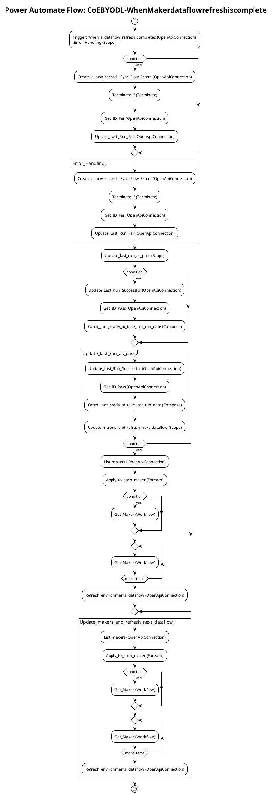

# Power Automate Flow: CoEBYODL-WhenMakerdataflowrefreshiscomplete

**Generated on:** 2025-07-15 19:14:48
**Flow ID:** 0022481F6FC7
**Source File:** CoEBYODL-WhenMakerdataflowrefreshiscomplete-AA1020DC-331E-ED11-B83E-0022481F6FC7.json

## Overview

This document contains detailed documentation for the Power Automate flow.

### Summary
- **Flow Name:** CoEBYODL-WhenMakerdataflowrefreshiscomplete
- **Triggers:** 1
- **Actions:** 1 1 1
- **Connections:** 3
- **Parameters:** 4

## Flow Diagram

## Connections

The following connections are used in this flow:

| Connection Key | API Name | Logical Name | Runtime Source |
|----------------|----------|--------------|----------------|
| shared_commondataserviceforapps | shared_commondataserviceforapps | admin_CoECoreDataverse2 | embedded |
| shared_commondataserviceforapps_1 | shared_commondataserviceforapps | admin_CoEBYODLDataverse | embedded |
| shared_dataflows_1 | shared_dataflows | admin_CoEBYODLPowerQuery | embedded |

## Parameters

| Parameter Name | Type | Default Value | Description |
|----------------|------|---------------|-------------|
| Current Environment (admin_CurrentEnvironment) | String | f5ca48ca-0d9c-e680-98c3-6e0123eaac01-31c688f59-westus | Current Environment ID. |
| Environment Dataflow ID (admin_EnvironmentDataflowID) | String | abc | LEAVE BLANK ON IMPORT. Dataflow ID of the CoE BYODL Environments dataflow. |
| Maker Dataflow ID (admin_MakerDataflowID) | String | abc | LEAVE BLANK ON IMPORT. Dataflow ID of the CoE BYODL Makers dataflow. |
| Power Automate Environment Variable (admin_PowerAutomateEnvironmentVariable) | String | https://flow.microsoft.com/manage/environments/ | Inventory - REQUIRED. Environment, including geographic location, for Power Automate - Ex for commercial: https://flow.microsoft.com/manage/environments/ |

## Triggers

### When_a_dataflow_refresh_completes
- **Type:** OpenApiConnection
- **Recurrence:** Frequency: Minute, Interval: 1

## Actions Summary

| Action Name | Type | Description |
|-------------|------|-------------|
| Error_Handling | Scope | Operation ID: 38ae684e-622d-42ea-abd2-ee571aee3a5f |
| Update_last_run_as_pass | Scope | Operation ID: 5c140442-d939-4ca4-8ec8-d1ee2bed4a81 |
| Update_makers_and_refresh_next_dataflow | Scope | Operation ID: dcab02dd-b0d8-4d16-9de6-d322931a78b3 |

---
*Documentation generated by Mightora Power Platform Workflows Documentation Generator*
