# Power Automate Flow: DLPEditorParseimpactedresourcesintoCSV

**Generated on:** 2025-07-15 19:14:48
**Flow ID:** 0022481D6E1E
**Source File:** DLPEditorParseimpactedresourcesintoCSV-3ACDDF40-8D5E-EC11-8F8F-0022481D6E1E.json

## Overview

This document contains detailed documentation for the Power Automate flow.

### Summary
- **Flow Name:** DLPEditorParseimpactedresourcesintoCSV
- **Triggers:** 1
- **Actions:** 1 1 1 1 1 1
- **Connections:** 3
- **Parameters:** 4

## Flow Diagram

```plantuml
@startuml
!theme plain
title Power Automate Flow: DLPEditorParseimpactedresourcesintoCSV

start
:Trigger: manual (Request);\n:Initialize_variable (InitializeVariable);
:Initialize_variable_2 (InitializeVariable);
:Initialize_emailGUID (InitializeVariable);
:Send_DLP_CSV (Scope);
 if (condition) then (yes)
  :Parse_Environments (ParseJson);
  :Select_Environments (Select);
  :List_apps (OpenApiConnection);
  :List_flows (OpenApiConnection);
  :Parse_Business_connectors (ParseJson);
  :Select_business (Select);
  :Parse_NonBusiness_connectors (ParseJson);
  :Select_nonbusiness (Select);
  :Parse_Blocked_Connectors (ParseJson);
  :Select_blocked (Select);
  :Apply_to_each_app (Foreach);
   if (condition) then (yes)
    :If_App_has_connections (If);
     if (condition) then (yes)
      :If_apps_with_both_business_and_non_business_connections_found (If);
       if (condition) then (yes)
        :Add_app_to_impacted_apps_2 (AppendToArrayVariable);
       endif
      :Conflict__NonBusinessApps (Query);
      :Conflict__BusinessApps (Query);
      :If_apps_with_blocked_connections_found (If);
       if (condition) then (yes)
        :Add_app_to_impacted_apps (AppendToArrayVariable);
       endif
      :Blocked__Impacted_Apps (Query);
      :Compose__Impacted_Apps_as_String (Compose);
      :Compose__Business_Impact_as_String (Compose);
      :Compose__NonBusiness_Impact_as_String (Compose);
     endif
   endif
   repeat
    :If_App_has_connections (If);
     if (condition) then (yes)
      :If_apps_with_both_business_and_non_business_connections_found (If);
       if (condition) then (yes)
        :Add_app_to_impacted_apps_2 (AppendToArrayVariable);
       endif
      :Conflict__NonBusinessApps (Query);
      :Conflict__BusinessApps (Query);
      :If_apps_with_blocked_connections_found (If);
       if (condition) then (yes)
        :Add_app_to_impacted_apps (AppendToArrayVariable);
       endif
      :Blocked__Impacted_Apps (Query);
      :Compose__Impacted_Apps_as_String (Compose);
      :Compose__Business_Impact_as_String (Compose);
      :Compose__NonBusiness_Impact_as_String (Compose);
     endif
   repeat while (more items)
  :Apply_to_each_flow (Foreach);
   if (condition) then (yes)
    :If_Flow_has_connections (If);
     if (condition) then (yes)
      :Blocked__Impacted_Flows (Query);
      :If_flows_with_blocked_connections_found (If);
       if (condition) then (yes)
        :Add_flow_to_impacted_flows (AppendToArrayVariable);
       endif
      :Conflict__Business_Flows (Query);
      :If_flows_with_both_business_and_non_business_connections_found (If);
       if (condition) then (yes)
        :Add_flow_to_impacted_flows_2 (AppendToArrayVariable);
       endif
      :Conflict__NonBusinessFlows (Query);
      :Compose__Blocked_Flows_as_String (Compose);
      :Compose__Business_Impact_Flows_as_String (Compose);
      :Compose__NonBusiness_Impact_Flows_as_String (Compose);
     endif
   endif
   repeat
    :If_Flow_has_connections (If);
     if (condition) then (yes)
      :Blocked__Impacted_Flows (Query);
      :If_flows_with_blocked_connections_found (If);
       if (condition) then (yes)
        :Add_flow_to_impacted_flows (AppendToArrayVariable);
       endif
      :Conflict__Business_Flows (Query);
      :If_flows_with_both_business_and_non_business_connections_found (If);
       if (condition) then (yes)
        :Add_flow_to_impacted_flows_2 (AppendToArrayVariable);
       endif
      :Conflict__NonBusinessFlows (Query);
      :Compose__Blocked_Flows_as_String (Compose);
      :Compose__Business_Impact_Flows_as_String (Compose);
      :Compose__NonBusiness_Impact_Flows_as_String (Compose);
     endif
   repeat while (more items)
  :Create_CSV_table_for_flows (Table);
  :Filter_business (Query);
  :Filter_nonbusiness (Query);
  :Create_CSV_table_for_apps (Table);
  :Switch_export_option (Switch);
  :If_Flow_list_empty_and_export_type_csv (If);
   if (condition) then (yes)
    :Add_no_flows_note_to_impacted_flows (AppendToArrayVariable);
   endif
  :If_App_list_empty_and_export_type_csv (If);
   if (condition) then (yes)
    :Add_no_apps_note_to_impacted_apps (AppendToArrayVariable);
   endif
 endif
 partition "Send_DLP_CSV" {
  :Parse_Environments (ParseJson);
  :Select_Environments (Select);
  :List_apps (OpenApiConnection);
  :List_flows (OpenApiConnection);
  :Parse_Business_connectors (ParseJson);
  :Select_business (Select);
  :Parse_NonBusiness_connectors (ParseJson);
  :Select_nonbusiness (Select);
  :Parse_Blocked_Connectors (ParseJson);
  :Select_blocked (Select);
  :Apply_to_each_app (Foreach);
   if (condition) then (yes)
    :If_App_has_connections (If);
     if (condition) then (yes)
      :If_apps_with_both_business_and_non_business_connections_found (If);
       if (condition) then (yes)
        :Add_app_to_impacted_apps_2 (AppendToArrayVariable);
       endif
      :Conflict__NonBusinessApps (Query);
      :Conflict__BusinessApps (Query);
      :If_apps_with_blocked_connections_found (If);
       if (condition) then (yes)
        :Add_app_to_impacted_apps (AppendToArrayVariable);
       endif
      :Blocked__Impacted_Apps (Query);
      :Compose__Impacted_Apps_as_String (Compose);
      :Compose__Business_Impact_as_String (Compose);
      :Compose__NonBusiness_Impact_as_String (Compose);
     endif
   endif
   repeat
    :If_App_has_connections (If);
     if (condition) then (yes)
      :If_apps_with_both_business_and_non_business_connections_found (If);
       if (condition) then (yes)
        :Add_app_to_impacted_apps_2 (AppendToArrayVariable);
       endif
      :Conflict__NonBusinessApps (Query);
      :Conflict__BusinessApps (Query);
      :If_apps_with_blocked_connections_found (If);
       if (condition) then (yes)
        :Add_app_to_impacted_apps (AppendToArrayVariable);
       endif
      :Blocked__Impacted_Apps (Query);
      :Compose__Impacted_Apps_as_String (Compose);
      :Compose__Business_Impact_as_String (Compose);
      :Compose__NonBusiness_Impact_as_String (Compose);
     endif
   repeat while (more items)
  :Apply_to_each_flow (Foreach);
   if (condition) then (yes)
    :If_Flow_has_connections (If);
     if (condition) then (yes)
      :Blocked__Impacted_Flows (Query);
      :If_flows_with_blocked_connections_found (If);
       if (condition) then (yes)
        :Add_flow_to_impacted_flows (AppendToArrayVariable);
       endif
      :Conflict__Business_Flows (Query);
      :If_flows_with_both_business_and_non_business_connections_found (If);
       if (condition) then (yes)
        :Add_flow_to_impacted_flows_2 (AppendToArrayVariable);
       endif
      :Conflict__NonBusinessFlows (Query);
      :Compose__Blocked_Flows_as_String (Compose);
      :Compose__Business_Impact_Flows_as_String (Compose);
      :Compose__NonBusiness_Impact_Flows_as_String (Compose);
     endif
   endif
   repeat
    :If_Flow_has_connections (If);
     if (condition) then (yes)
      :Blocked__Impacted_Flows (Query);
      :If_flows_with_blocked_connections_found (If);
       if (condition) then (yes)
        :Add_flow_to_impacted_flows (AppendToArrayVariable);
       endif
      :Conflict__Business_Flows (Query);
      :If_flows_with_both_business_and_non_business_connections_found (If);
       if (condition) then (yes)
        :Add_flow_to_impacted_flows_2 (AppendToArrayVariable);
       endif
      :Conflict__NonBusinessFlows (Query);
      :Compose__Blocked_Flows_as_String (Compose);
      :Compose__Business_Impact_Flows_as_String (Compose);
      :Compose__NonBusiness_Impact_Flows_as_String (Compose);
     endif
   repeat while (more items)
  :Create_CSV_table_for_flows (Table);
  :Filter_business (Query);
  :Filter_nonbusiness (Query);
  :Create_CSV_table_for_apps (Table);
  :Switch_export_option (Switch);
  :If_Flow_list_empty_and_export_type_csv (If);
   if (condition) then (yes)
    :Add_no_flows_note_to_impacted_flows (AppendToArrayVariable);
   endif
  :If_App_list_empty_and_export_type_csv (If);
   if (condition) then (yes)
    :Add_no_apps_note_to_impacted_apps (AppendToArrayVariable);
   endif
 }
:Error_Handling (Scope);
 if (condition) then (yes)
  :Create_a_new_record__Sync_Flow_Errors (OpenApiConnection);
  :Terminate (Terminate);
  :Get_ID_Fail (OpenApiConnection);
  :Update_Last_Run_Fail (OpenApiConnection);
 endif
 partition "Error_Handling" {
  :Create_a_new_record__Sync_Flow_Errors (OpenApiConnection);
  :Terminate (Terminate);
  :Get_ID_Fail (OpenApiConnection);
  :Update_Last_Run_Fail (OpenApiConnection);
 }
:Update_last_run_as_pass (Scope);
 if (condition) then (yes)
  :Update_Last_Run_Successful (OpenApiConnection);
  :Get_ID_Pass (OpenApiConnection);
  :Catch__not_ready_to_take_last_run_date (Compose);
 endif
 partition "Update_last_run_as_pass" {
  :Update_Last_Run_Successful (OpenApiConnection);
  :Get_ID_Pass (OpenApiConnection);
  :Catch__not_ready_to_take_last_run_date (Compose);
 }

stop
@enduml
```

## Connections

The following connections are used in this flow:

| Connection Key | API Name | Logical Name | Runtime Source |
|----------------|----------|--------------|----------------|
| shared_commondataserviceforapps_1 | shared_commondataserviceforapps | admin_CoECoreDataverse2 | embedded |
| shared_office365users | shared_office365users | admin_CoECoreOffice365Users | invoker |
| shared_office365_1 | shared_office365 | admin_CoECoreO365Outlook | invoker |

## Parameters

| Parameter Name | Type | Default Value | Description |
|----------------|------|---------------|-------------|
| eMail Body Start (admin_eMailBodyStart) | String | <body>     
         <table id='form'>             <tr>                 <td></td>             </tr>             <tr>                 <td>                     
Power Platform
                 </td>             </tr>             <tr id='ribbon'>                 <td>                     <tr>                         <td></td>                     </tr>                     <tr id='message'>                         <td> | Inventory - Starter HTML format for eMails |
| eMail Body Stop (admin_eMailBodyStop) | String | </td>                     </tr>         </table>     
 </body> | Inventory - Ending HTML format for eMails |
| eMail Header Style (admin_eMailHeaderStyle) | String | <head>      </head> | Inventory - CSS/Style used for eMails |
| Power Automate Environment Variable (admin_PowerAutomateEnvironmentVariable) | String | https://flow.microsoft.com/manage/environments/ | Inventory - REQUIRED. Environment, including geographic location, for Power Automate - Ex for commercial: https://flow.microsoft.com/manage/environments/ |

## Triggers

### manual
- **Type:** Request
- **Recurrence:** N/A

## Actions Summary

| Action Name | Type | Description |
|-------------|------|-------------|
| Initialize_variable | InitializeVariable | Operation ID: 745280d5-220e-4d36-bd71-cfb3719b76c5 |
| Initialize_variable_2 | InitializeVariable | Operation ID: 2a49175f-5f3b-42f9-a284-3e977b4408a4 |
| Initialize_emailGUID | InitializeVariable | Operation ID: dad8eca6-7937-47c0-aa57-f2d48dd1c5a2 |
| Send_DLP_CSV | Scope | Operation ID: 3586ed4b-989d-4fbd-84c1-854e8f548480 |
| Error_Handling | Scope | Operation ID: 38ae684e-622d-42ea-abd2-ee571aee3a5f |
| Update_last_run_as_pass | Scope | Operation ID: 5c140442-d939-4ca4-8ec8-d1ee2bed4a81 |

---
*Documentation generated by Mightora Power Platform Workflows Documentation Generator*
