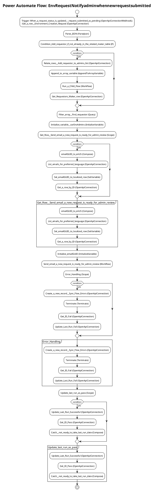

# Power Automate Flow: EnvRequestNotifyadminwhennewrequestsubmitted

**Generated on:** 2025-07-15 19:14:48
**Flow ID:** 000D3A9A8A99
**Source File:** EnvRequestNotifyadminwhennewrequestsubmitted-CCF69C24-E160-EB11-A812-000D3A9A8A99.json

## Overview

This document contains detailed documentation for the Power Automate flow.

### Summary
- **Flow Name:** EnvRequestNotifyadminwhennewrequestsubmitted
- **Triggers:** 1
- **Actions:** 1 1 1 1 1 1 1 1 1 1
- **Connections:** 2
- **Parameters:** 4

## Flow Diagram

## Connections

The following connections are used in this flow:

| Connection Key | API Name | Logical Name | Runtime Source |
|----------------|----------|--------------|----------------|
| shared_commondataserviceforapps_2 | shared_commondataserviceforapps | admin_sharedcommondataserviceforapps_98924 | embedded |
| shared_commondataserviceforapps | shared_commondataserviceforapps | admin_sharedcommondataserviceforapps_98924 | embedded |

## Parameters

| Parameter Name | Type | Default Value | Description |
|----------------|------|---------------|-------------|
| Admin eMail Preferred Language (admin_AdmineMailPreferredLanguage) | String | en-US | Inventory - The preferred language for the emails sent to the admin email alias, which is specified in theAdmin eMail environment variable. Default is en-US |
| Environment Request Admin App Url (coe_EnvironmentRequestAdminAppUrl) | String | https://apps.powerapps.com/play/e/c88c7061-6eea-e86a-a0dd-926a8e97d41d/a/91b1ee20-38bf-4287-832f-a6c8e28fcdbf?tenantId=67c96cd6-4a95-46ee-ac9b-8ee13ae256c4&source=portal | Env Request - LEAVE EMPTY ON IMPORT. URL to Environment Request Admin Canvas App. |
| Admin eMail (admin_AdminMail) | String | PowerPlatformAdmins@powercattools.onmicrosoft.com | Inventory - CoE Admin eMail. Email address used in flows to send notifications to admins; this should be either your email address or a distribution list |
| Power Automate Environment Variable (admin_PowerAutomateEnvironmentVariable) | String | https://flow.microsoft.com/manage/environments/ | Inventory - REQUIRED. Environment, including geographic location, for Power Automate - Ex for commercial: https://flow.microsoft.com/manage/environments/ |

## Triggers

### When_a_request_status_is_updated_-_request_submitted_as_pending
- **Type:** OpenApiConnectionWebhook
- **Recurrence:** N/A

## Actions Summary

| Action Name | Type | Description |
|-------------|------|-------------|
| Get_a_row_-_Environment_Creation_Request | OpenApiConnection | Operation ID: 6eea192f-824a-4e5f-ab2f-de5fd498981e |
| Parse_JSON | ParseJson | Operation ID: c3fd10fe-e6df-49f8-90c0-f545881fc3fa |
| Condition:_Add_requestor_if_not_already_in_the_related_maker_table | If | Operation ID: 0ac76979-9fce-4fc9-8455-0a4182b87d9b |
| Filter_array_-_Find_requestor | Query | Operation ID: 0b89f5cd-5f95-4a05-96ee-f2ea1a11dac7 |
| Initialize_variable_-_varEnvAdmins | InitializeVariable | Operation ID: 3d249227-d1ab-4725-ac8a-ad9ae250f12b |
| Get_Row_-_Send_email_a_new_request_is_ready_for_admin_review | Scope | Operation ID: 1ac2f42d-c869-4350-a393-2b7f1c09c144 |
| Initialize_emailGUID | InitializeVariable | Operation ID: 22139bda-e595-413d-86c7-b78bc4f53325 |
| Send_email_a_new_request_is_ready_for_admin_review | Workflow | Operation ID: 99df8926-acf9-4434-b9d1-c68c50cb55f4 |
| Error_Handling | Scope | Operation ID: 38ae684e-622d-42ea-abd2-ee571aee3a5f |
| Update_last_run_as_pass | Scope | Operation ID: 5c140442-d939-4ca4-8ec8-d1ee2bed4a81 |

---
*Documentation generated by Mightora Power Platform Workflows Documentation Generator*
