# Power Automate Flow: HELPER-CanvasAppOperations

**Generated on:** 2025-07-15 19:14:48
**Flow ID:** 000D3A5786FB
**Source File:** HELPER-CanvasAppOperations-41263D72-4DEA-EB11-BACB-000D3A5786FB.json

## Overview

This document contains detailed documentation for the Power Automate flow.

### Summary
- **Flow Name:** HELPER-CanvasAppOperations
- **Triggers:** 1
- **Actions:** 1 1 1 1 1
- **Connections:** 5
- **Parameters:** 1

## Flow Diagram

```plantuml
@startuml
!theme plain
title Power Automate Flow: HELPER-CanvasAppOperations

start
:Trigger: manual (Request);\n:Initialize_ReturnString_to_pass (InitializeVariable);
:Perform_Canvas_App_Operation (Scope);
 if (condition) then (yes)
  :Get_app_from_CoE (OpenApiConnection);
  :Set_ReturnString_to_Not_Found (SetVariable);
  :If_found_in_inventory_then_continue (If);
   if (condition) then (yes)
    :Switch_on_action_input (Switch);
    :Group_or_User (Scope);
     if (condition) then (yes)
      :Set_isGroup_variable_to_input_parameter (SetVariable);
      :Catch_paramater_missing__default_is_false (Compose);
     endif
     partition "Group_or_User" {
      :Set_isGroup_variable_to_input_parameter (SetVariable);
      :Catch_paramater_missing__default_is_false (Compose);
     }
    :Get_User_Info_if_not_null (If);
     if (condition) then (yes)
      :Get_user_photo_V2 (OpenApiConnection);
      :Get_user_profile_V2 (OpenApiConnection);
      :Catch__for_delete_cases_with_no_user__photo (Compose);
      :Catch__for_delete_cases_with_no_user__profile (Compose);
     endif
    :Get_Group_Info_if_not_null (If);
     if (condition) then (yes)
      :List_group_members (OpenApiConnection);
      :Find_group (OpenApiConnection);
      :Group_Size (Compose);
      :Group_Name (Compose);
      :Group_Email (Compose);
     endif
   endif
  :Respond_to_a_PowerApp_or_flow (Response);
 endif
 partition "Perform_Canvas_App_Operation" {
  :Get_app_from_CoE (OpenApiConnection);
  :Set_ReturnString_to_Not_Found (SetVariable);
  :If_found_in_inventory_then_continue (If);
   if (condition) then (yes)
    :Switch_on_action_input (Switch);
    :Group_or_User (Scope);
     if (condition) then (yes)
      :Set_isGroup_variable_to_input_parameter (SetVariable);
      :Catch_paramater_missing__default_is_false (Compose);
     endif
     partition "Group_or_User" {
      :Set_isGroup_variable_to_input_parameter (SetVariable);
      :Catch_paramater_missing__default_is_false (Compose);
     }
    :Get_User_Info_if_not_null (If);
     if (condition) then (yes)
      :Get_user_photo_V2 (OpenApiConnection);
      :Get_user_profile_V2 (OpenApiConnection);
      :Catch__for_delete_cases_with_no_user__photo (Compose);
      :Catch__for_delete_cases_with_no_user__profile (Compose);
     endif
    :Get_Group_Info_if_not_null (If);
     if (condition) then (yes)
      :List_group_members (OpenApiConnection);
      :Find_group (OpenApiConnection);
      :Group_Size (Compose);
      :Group_Name (Compose);
      :Group_Email (Compose);
     endif
   endif
  :Respond_to_a_PowerApp_or_flow (Response);
 }
:Error_Handling (Scope);
 if (condition) then (yes)
  :Create_a_new_record__Sync_Flow_Errors (OpenApiConnection);
  :Terminate (Terminate);
  :Get_ID_Fail (OpenApiConnection);
  :Update_Last_Run_Fail (OpenApiConnection);
 endif
 partition "Error_Handling" {
  :Create_a_new_record__Sync_Flow_Errors (OpenApiConnection);
  :Terminate (Terminate);
  :Get_ID_Fail (OpenApiConnection);
  :Update_Last_Run_Fail (OpenApiConnection);
 }
:Update_last_run_as_pass (Scope);
 if (condition) then (yes)
  :Update_Last_Run_Successful (OpenApiConnection);
  :Get_ID_Pass (OpenApiConnection);
  :Catch__not_ready_to_take_last_run_date (Compose);
 endif
 partition "Update_last_run_as_pass" {
  :Update_Last_Run_Successful (OpenApiConnection);
  :Get_ID_Pass (OpenApiConnection);
  :Catch__not_ready_to_take_last_run_date (Compose);
 }
:Initialize_isGroup (InitializeVariable);

stop
@enduml
```

## Connections

The following connections are used in this flow:

| Connection Key | API Name | Logical Name | Runtime Source |
|----------------|----------|--------------|----------------|
| shared_commondataserviceforapps | shared_commondataserviceforapps | admin_CoECoreDataverse2 | embedded |
| shared_powerappsforadmins | shared_powerappsforadmins | admin_CoECorePowerAppsAdmin | embedded |
| shared_powerappsforadmins_1 | shared_powerappsforadmins | admin_CoECorePowerAppsAdmin2 | embedded |
| shared_office365users | shared_office365users | admin_CoECoreO365Users | embedded |
| shared_office365groups | shared_office365groups | admin_CoECoreO365Groups | embedded |

## Parameters

| Parameter Name | Type | Default Value | Description |
|----------------|------|---------------|-------------|
| Power Automate Environment Variable (admin_PowerAutomateEnvironmentVariable) | String | https://flow.microsoft.com/manage/environments/ | Inventory - REQUIRED. Environment, including geographic location, for Power Automate - Ex for commercial: https://flow.microsoft.com/manage/environments/ |

## Triggers

### manual
- **Type:** Request
- **Recurrence:** N/A

## Actions Summary

| Action Name | Type | Description |
|-------------|------|-------------|
| Initialize_ReturnString_to_pass | InitializeVariable | Operation ID: cd66f8bb-cf7b-4b8f-9da2-2e8c1da7ec0e |
| Perform_Canvas_App_Operation | Scope | Operation ID: 958b56ca-f244-4c54-89e1-578b4dc3284c |
| Error_Handling | Scope | Operation ID: 38ae684e-622d-42ea-abd2-ee571aee3a5f |
| Update_last_run_as_pass | Scope | Operation ID: 5c140442-d939-4ca4-8ec8-d1ee2bed4a81 |
| Initialize_isGroup | InitializeVariable | Operation ID: 94d830a3-08e6-440e-a50e-c1781ae1ae1a |

---
*Documentation generated by Mightora Power Platform Workflows Documentation Generator*
