# Power Automate Flow: HELPER-DriverEscalationCheck

**Generated on:** 2025-07-15 19:14:48
**Flow ID:** 6045BD039C1F
**Source File:** HELPER-DriverEscalationCheck-7F01D8AE-CA50-EF11-A316-6045BD039C1F.json

## Overview

This document contains detailed documentation for the Power Automate flow.

### Summary
- **Flow Name:** HELPER-DriverEscalationCheck
- **Triggers:** 1
- **Actions:** 1 1 1 1 1
- **Connections:** 3
- **Parameters:** 1

## Flow Diagram

```plantuml
@startuml
!theme plain
title Power Automate Flow: HELPER-DriverEscalationCheck

start
:Trigger: manual (Request);\n:Escalation_Check (Scope);
 if (condition) then (yes)
  :Delay_before_trying_again (Wait);
  :Report_failure_if_needed (Scope);
   if (condition) then (yes)
    :If_not_sys_admin_then_report (If);
     if (condition) then (yes)
      :Add_record_in_Sync_Flow_Errors_so_they_can_manually_add (OpenApiConnection);
     endif
   endif
   partition "Report_failure_if_needed" {
    :If_not_sys_admin_then_report (If);
     if (condition) then (yes)
      :Add_record_in_Sync_Flow_Errors_so_they_can_manually_add (OpenApiConnection);
     endif
   }
  :try_again_and_determine_permissions (Scope);
   if (condition) then (yes)
    :Grants_requesting_tenant_admin_user_the_system_admin_role (OpenApiConnection);
    :Second_try_failed (Scope);
     if (condition) then (yes)
      :Check_if_already_sys_admin (Scope);
       if (condition) then (yes)
        :SysAdmin_TemplateID (Compose);
        :Get_my_profile_V2 (OpenApiConnection);
        :Get_Admin_SR (OpenApiConnection);
        :Direct_System_User_Access (OpenApiConnection);
        :Security_Role_Display_Name (Compose);
        :If_user_not_already_sys_admin_will_report (If);
         if (condition) then (yes)
          :Set_hasSysAdminAccess_false_if_not_found (SetVariable);
         endif
        :Filter_to_this_user_as_sys_admin (Query);
       endif
       partition "Check_if_already_sys_admin" {
        :SysAdmin_TemplateID (Compose);
        :Get_my_profile_V2 (OpenApiConnection);
        :Get_Admin_SR (OpenApiConnection);
        :Direct_System_User_Access (OpenApiConnection);
        :Security_Role_Display_Name (Compose);
        :If_user_not_already_sys_admin_will_report (If);
         if (condition) then (yes)
          :Set_hasSysAdminAccess_false_if_not_found (SetVariable);
         endif
        :Filter_to_this_user_as_sys_admin (Query);
       }
      :Set_hasSysAdminAccess_false_if_any_failure_above (SetVariable);
     endif
     partition "Second_try_failed" {
      :Check_if_already_sys_admin (Scope);
       if (condition) then (yes)
        :SysAdmin_TemplateID (Compose);
        :Get_my_profile_V2 (OpenApiConnection);
        :Get_Admin_SR (OpenApiConnection);
        :Direct_System_User_Access (OpenApiConnection);
        :Security_Role_Display_Name (Compose);
        :If_user_not_already_sys_admin_will_report (If);
         if (condition) then (yes)
          :Set_hasSysAdminAccess_false_if_not_found (SetVariable);
         endif
        :Filter_to_this_user_as_sys_admin (Query);
       endif
       partition "Check_if_already_sys_admin" {
        :SysAdmin_TemplateID (Compose);
        :Get_my_profile_V2 (OpenApiConnection);
        :Get_Admin_SR (OpenApiConnection);
        :Direct_System_User_Access (OpenApiConnection);
        :Security_Role_Display_Name (Compose);
        :If_user_not_already_sys_admin_will_report (If);
         if (condition) then (yes)
          :Set_hasSysAdminAccess_false_if_not_found (SetVariable);
         endif
        :Filter_to_this_user_as_sys_admin (Query);
       }
      :Set_hasSysAdminAccess_false_if_any_failure_above (SetVariable);
     }
   endif
   partition "try_again_and_determine_permissions" {
    :Grants_requesting_tenant_admin_user_the_system_admin_role (OpenApiConnection);
    :Second_try_failed (Scope);
     if (condition) then (yes)
      :Check_if_already_sys_admin (Scope);
       if (condition) then (yes)
        :SysAdmin_TemplateID (Compose);
        :Get_my_profile_V2 (OpenApiConnection);
        :Get_Admin_SR (OpenApiConnection);
        :Direct_System_User_Access (OpenApiConnection);
        :Security_Role_Display_Name (Compose);
        :If_user_not_already_sys_admin_will_report (If);
         if (condition) then (yes)
          :Set_hasSysAdminAccess_false_if_not_found (SetVariable);
         endif
        :Filter_to_this_user_as_sys_admin (Query);
       endif
       partition "Check_if_already_sys_admin" {
        :SysAdmin_TemplateID (Compose);
        :Get_my_profile_V2 (OpenApiConnection);
        :Get_Admin_SR (OpenApiConnection);
        :Direct_System_User_Access (OpenApiConnection);
        :Security_Role_Display_Name (Compose);
        :If_user_not_already_sys_admin_will_report (If);
         if (condition) then (yes)
          :Set_hasSysAdminAccess_false_if_not_found (SetVariable);
         endif
        :Filter_to_this_user_as_sys_admin (Query);
       }
      :Set_hasSysAdminAccess_false_if_any_failure_above (SetVariable);
     endif
     partition "Second_try_failed" {
      :Check_if_already_sys_admin (Scope);
       if (condition) then (yes)
        :SysAdmin_TemplateID (Compose);
        :Get_my_profile_V2 (OpenApiConnection);
        :Get_Admin_SR (OpenApiConnection);
        :Direct_System_User_Access (OpenApiConnection);
        :Security_Role_Display_Name (Compose);
        :If_user_not_already_sys_admin_will_report (If);
         if (condition) then (yes)
          :Set_hasSysAdminAccess_false_if_not_found (SetVariable);
         endif
        :Filter_to_this_user_as_sys_admin (Query);
       endif
       partition "Check_if_already_sys_admin" {
        :SysAdmin_TemplateID (Compose);
        :Get_my_profile_V2 (OpenApiConnection);
        :Get_Admin_SR (OpenApiConnection);
        :Direct_System_User_Access (OpenApiConnection);
        :Security_Role_Display_Name (Compose);
        :If_user_not_already_sys_admin_will_report (If);
         if (condition) then (yes)
          :Set_hasSysAdminAccess_false_if_not_found (SetVariable);
         endif
        :Filter_to_this_user_as_sys_admin (Query);
       }
      :Set_hasSysAdminAccess_false_if_any_failure_above (SetVariable);
     }
   }
 endif
 partition "Escalation_Check" {
  :Delay_before_trying_again (Wait);
  :Report_failure_if_needed (Scope);
   if (condition) then (yes)
    :If_not_sys_admin_then_report (If);
     if (condition) then (yes)
      :Add_record_in_Sync_Flow_Errors_so_they_can_manually_add (OpenApiConnection);
     endif
   endif
   partition "Report_failure_if_needed" {
    :If_not_sys_admin_then_report (If);
     if (condition) then (yes)
      :Add_record_in_Sync_Flow_Errors_so_they_can_manually_add (OpenApiConnection);
     endif
   }
  :try_again_and_determine_permissions (Scope);
   if (condition) then (yes)
    :Grants_requesting_tenant_admin_user_the_system_admin_role (OpenApiConnection);
    :Second_try_failed (Scope);
     if (condition) then (yes)
      :Check_if_already_sys_admin (Scope);
       if (condition) then (yes)
        :SysAdmin_TemplateID (Compose);
        :Get_my_profile_V2 (OpenApiConnection);
        :Get_Admin_SR (OpenApiConnection);
        :Direct_System_User_Access (OpenApiConnection);
        :Security_Role_Display_Name (Compose);
        :If_user_not_already_sys_admin_will_report (If);
         if (condition) then (yes)
          :Set_hasSysAdminAccess_false_if_not_found (SetVariable);
         endif
        :Filter_to_this_user_as_sys_admin (Query);
       endif
       partition "Check_if_already_sys_admin" {
        :SysAdmin_TemplateID (Compose);
        :Get_my_profile_V2 (OpenApiConnection);
        :Get_Admin_SR (OpenApiConnection);
        :Direct_System_User_Access (OpenApiConnection);
        :Security_Role_Display_Name (Compose);
        :If_user_not_already_sys_admin_will_report (If);
         if (condition) then (yes)
          :Set_hasSysAdminAccess_false_if_not_found (SetVariable);
         endif
        :Filter_to_this_user_as_sys_admin (Query);
       }
      :Set_hasSysAdminAccess_false_if_any_failure_above (SetVariable);
     endif
     partition "Second_try_failed" {
      :Check_if_already_sys_admin (Scope);
       if (condition) then (yes)
        :SysAdmin_TemplateID (Compose);
        :Get_my_profile_V2 (OpenApiConnection);
        :Get_Admin_SR (OpenApiConnection);
        :Direct_System_User_Access (OpenApiConnection);
        :Security_Role_Display_Name (Compose);
        :If_user_not_already_sys_admin_will_report (If);
         if (condition) then (yes)
          :Set_hasSysAdminAccess_false_if_not_found (SetVariable);
         endif
        :Filter_to_this_user_as_sys_admin (Query);
       endif
       partition "Check_if_already_sys_admin" {
        :SysAdmin_TemplateID (Compose);
        :Get_my_profile_V2 (OpenApiConnection);
        :Get_Admin_SR (OpenApiConnection);
        :Direct_System_User_Access (OpenApiConnection);
        :Security_Role_Display_Name (Compose);
        :If_user_not_already_sys_admin_will_report (If);
         if (condition) then (yes)
          :Set_hasSysAdminAccess_false_if_not_found (SetVariable);
         endif
        :Filter_to_this_user_as_sys_admin (Query);
       }
      :Set_hasSysAdminAccess_false_if_any_failure_above (SetVariable);
     }
   endif
   partition "try_again_and_determine_permissions" {
    :Grants_requesting_tenant_admin_user_the_system_admin_role (OpenApiConnection);
    :Second_try_failed (Scope);
     if (condition) then (yes)
      :Check_if_already_sys_admin (Scope);
       if (condition) then (yes)
        :SysAdmin_TemplateID (Compose);
        :Get_my_profile_V2 (OpenApiConnection);
        :Get_Admin_SR (OpenApiConnection);
        :Direct_System_User_Access (OpenApiConnection);
        :Security_Role_Display_Name (Compose);
        :If_user_not_already_sys_admin_will_report (If);
         if (condition) then (yes)
          :Set_hasSysAdminAccess_false_if_not_found (SetVariable);
         endif
        :Filter_to_this_user_as_sys_admin (Query);
       endif
       partition "Check_if_already_sys_admin" {
        :SysAdmin_TemplateID (Compose);
        :Get_my_profile_V2 (OpenApiConnection);
        :Get_Admin_SR (OpenApiConnection);
        :Direct_System_User_Access (OpenApiConnection);
        :Security_Role_Display_Name (Compose);
        :If_user_not_already_sys_admin_will_report (If);
         if (condition) then (yes)
          :Set_hasSysAdminAccess_false_if_not_found (SetVariable);
         endif
        :Filter_to_this_user_as_sys_admin (Query);
       }
      :Set_hasSysAdminAccess_false_if_any_failure_above (SetVariable);
     endif
     partition "Second_try_failed" {
      :Check_if_already_sys_admin (Scope);
       if (condition) then (yes)
        :SysAdmin_TemplateID (Compose);
        :Get_my_profile_V2 (OpenApiConnection);
        :Get_Admin_SR (OpenApiConnection);
        :Direct_System_User_Access (OpenApiConnection);
        :Security_Role_Display_Name (Compose);
        :If_user_not_already_sys_admin_will_report (If);
         if (condition) then (yes)
          :Set_hasSysAdminAccess_false_if_not_found (SetVariable);
         endif
        :Filter_to_this_user_as_sys_admin (Query);
       endif
       partition "Check_if_already_sys_admin" {
        :SysAdmin_TemplateID (Compose);
        :Get_my_profile_V2 (OpenApiConnection);
        :Get_Admin_SR (OpenApiConnection);
        :Direct_System_User_Access (OpenApiConnection);
        :Security_Role_Display_Name (Compose);
        :If_user_not_already_sys_admin_will_report (If);
         if (condition) then (yes)
          :Set_hasSysAdminAccess_false_if_not_found (SetVariable);
         endif
        :Filter_to_this_user_as_sys_admin (Query);
       }
      :Set_hasSysAdminAccess_false_if_any_failure_above (SetVariable);
     }
   }
 }
:Error_Handling (Scope);
 if (condition) then (yes)
  :Create_a_new_record__Sync_Flow_Errors (OpenApiConnection);
  :Terminate (Terminate);
  :Get_ID_Fail (OpenApiConnection);
  :Update_Last_Run_Fail (OpenApiConnection);
 endif
 partition "Error_Handling" {
  :Create_a_new_record__Sync_Flow_Errors (OpenApiConnection);
  :Terminate (Terminate);
  :Get_ID_Fail (OpenApiConnection);
  :Update_Last_Run_Fail (OpenApiConnection);
 }
:Update_last_run_as_pass (Scope);
 if (condition) then (yes)
  :Update_Last_Run_Successful (OpenApiConnection);
  :Get_ID_Pass (OpenApiConnection);
 endif
 partition "Update_last_run_as_pass" {
  :Update_Last_Run_Successful (OpenApiConnection);
  :Get_ID_Pass (OpenApiConnection);
 }
:Respond_to_a_PowerApp_or_flow (Response);
:initialize_hasSysAdminAccess_true (InitializeVariable);

stop
@enduml
```

## Connections

The following connections are used in this flow:

| Connection Key | API Name | Logical Name | Runtime Source |
|----------------|----------|--------------|----------------|
| shared_commondataserviceforapps_2 | shared_commondataserviceforapps | admin_CoECoreDataverse | embedded |
| shared_powerplatformadminv2_1 | shared_powerplatformadminv2 | admin_CoECorePowerPlatformforAdminV2 | embedded |
| shared_office365users_1 | shared_office365users | admin_CoECoreOffice365Users | embedded |

## Parameters

| Parameter Name | Type | Default Value | Description |
|----------------|------|---------------|-------------|
| Power Automate Environment Variable (admin_PowerAutomateEnvironmentVariable) | String | https://flow.microsoft.com/manage/environments/ | Inventory - REQUIRED. Environment, including geographic location, for Power Automate - Ex for commercial: https://flow.microsoft.com/manage/environments/ |

## Triggers

### manual
- **Type:** Request
- **Recurrence:** N/A

## Actions Summary

| Action Name | Type | Description |
|-------------|------|-------------|
| Escalation_Check | Scope | Operation ID: 1356436e-8e40-4ba8-8d02-59ffbfee4790 |
| Error_Handling | Scope | Operation ID: 38ae684e-622d-42ea-abd2-ee571aee3a5f |
| Update_last_run_as_pass | Scope | Operation ID: 5c140442-d939-4ca4-8ec8-d1ee2bed4a81 |
| Respond_to_a_PowerApp_or_flow | Response | Operation ID: d2179fbf-0042-489a-9bb7-a23743aac56e |
| initialize_hasSysAdminAccess_true | InitializeVariable | Operation ID: 59a98265-a73f-4206-8866-5aa1ca1df105 |

---
*Documentation generated by Mightora Power Platform Workflows Documentation Generator*
