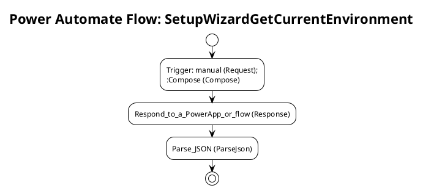

# Power Automate Flow: SetupWizardGetCurrentEnvironment

**Generated on:** 2025-07-15 19:14:48
**Flow ID:** 00224822E3B9
**Source File:** SetupWizardGetCurrentEnvironment-A13C1774-0723-ED11-B83E-00224822E3B9.json

## Overview

This document contains detailed documentation for the Power Automate flow.

### Summary
- **Flow Name:** SetupWizardGetCurrentEnvironment
- **Triggers:** 1
- **Actions:** 1 1 1
- **Connections:** 0
- **Parameters:** 0

## Flow Diagram

## Connections

The following connections are used in this flow:

| Connection Key | API Name | Logical Name | Runtime Source |
|----------------|----------|--------------|----------------|

## Triggers

### manual
- **Type:** Request
- **Recurrence:** N/A

## Actions Summary

| Action Name | Type | Description |
|-------------|------|-------------|
| Compose | Compose | Operation ID: 7a4c4551-c72a-46ad-a87c-67fb70a4272b |
| Respond_to_a_PowerApp_or_flow | Response | Operation ID: 44600db9-25d6-4627-a2a6-613e2669f1c1 |
| Parse_JSON | ParseJson | Operation ID: 5df8fa9a-349f-4e73-a1cf-46d86c4b1080 |

---
*Documentation generated by Mightora Power Platform Workflows Documentation Generator*
